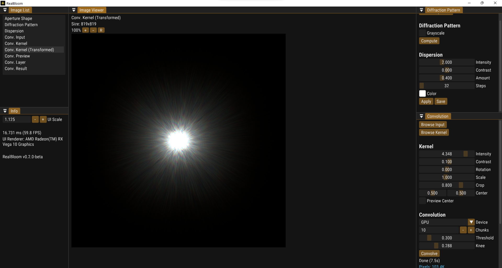
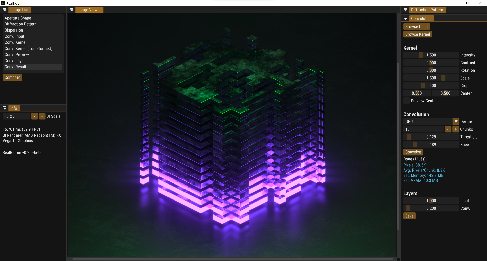
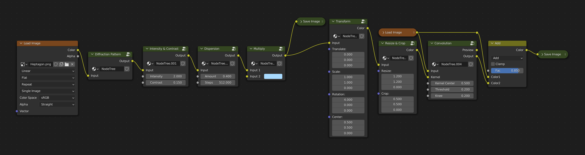

<!-- Improved compatibility of back to top link: See: https://github.com/othneildrew/Best-README-Template/pull/73 -->
<a name="readme-top"></a>
<!--
*** Thanks for checking out the Best-README-Template. If you have a suggestion
*** that would make this better, please fork the repo and create a pull request
*** or simply open an issue with the tag "enhancement".
*** Don't forget to give the project a star!
*** Thanks again! Now go create something AMAZING! :D
-->

<!-- PROJECT LOGO -->
<br />
<div align="center">
  <a href="https://github.com/bean-mhm/realbloom">
    
  </a>
<h3 align="center">RealBloom</h3>
  <p align="center">
    Physically Accurate Bloom Simulation Software for Windows
    <br />
    <a href="https://github.com/bean-mhm/realbloom/releases">Latest Release</a>
    ·
    <a href="https://github.com/bean-mhm/realbloom/issues">Report Bug</a>
    ·
    <a href="https://github.com/bean-mhm/realbloom/issues">Request Feature</a>
  </p>
</div>


<!-- TABLE OF CONTENTS -->
<details>
  <summary>Table of Contents</summary>
  <ol>
    <li><a href="#introduction">Introduction</a></li>
    <li><a href="#running-realbloom">Running RealBloom</a></li>
    <li><a href="#using-realbloom">Using RealBloom</a></li>
    <li><a href="#building-realbloom">Building RealBloom</a></li>
    <li><a href="#roadmap">Roadmap</a></li>
    <li><a href="#nodes">Nodes</a></li>
    <li><a href="#contributing">Contributing</a></li>
    <li><a href="#license">License</a></li>
    <li><a href="#contact">Contact</a></li>
  </ol>
</details>


<!-- INTRODUCTION -->
## Introduction

RealBloom lets you simulate physically accurate bloom effect for your 3D renders, or any HDR image.





RealBloom was started as a hobby project in late August 2022. This project was inspired by [AngeTheGreat's video](https://www.youtube.com/watch?v=QWqb5Gewbx8) on bloom and how to simulate it. **I highly recommend watching this video** in order to have a basic understanding of how RealBloom works. Make sure to check out their [GitHub page](https://github.com/ange-yaghi) and their other projcets as well!

The ultimate goal of writing this project was to achieve more realism in 3D renders that contain bright spots on dark backgrounds. For example, the sun in a blue sky, a car headlight at night, bright lights at a concert, or a flashlight pointing directly at the camera. You can learn about some other lens effects such as [Lens Flare](https://en.wikipedia.org/wiki/Lens_flare) and [Bokeh](https://en.wikipedia.org/wiki/Bokeh). If you're a [Blender](https://blender.org/) user like myself, you might want to watch [this video](https://www.youtube.com/watch?v=UDvuhuU9tFg) on applying a custom bokeh effect in Blender. The custom bokeh effect can be used alongside convolutional bloom to achieve a more life-like render.

### How It's Made

RealBloom is written in C++ using Visual Studio 2022. The target platform is Windows. However, considering the fact that all the libraries used and most of the code for RealBloom are platform-independent, it should be fairly easy to port it to another platform. I personally don't plan on doing that.

RealBloom uses the following libraries:
| Library | Used for |
|--|--|
| [FFTW](https://www.fftw.org/) | Generating diffraction patterns |
| [GLEW](https://glew.sourceforge.net/) | OpenGL extensions |
| [GLFW](https://www.glfw.org/) | Window and context creation for use in ImGui |
| [Dear ImGui](https://github.com/ocornut/imgui) | Graphical user interface |
| [LibTIFF](https://libtiff.gitlab.io/libtiff/) | Reading and writing TIFF image files |
| [LodePNG](https://lodev.org/lodepng/) | Reading and writing PNG image files |
| [NFD](https://github.com/mlabbe/nativefiledialog) | Native file dialogs |
| [inih](https://github.com/jtilly/inih) | Parsing config files |

<p align="right">(<a href="#readme-top">back to top</a>)</p>


<!-- RUNNING -->
## Running RealBloom

To run RealBloom, [Visual C++ Runtime](https://learn.microsoft.com/en-us/cpp/windows/latest-supported-vc-redist?view=msvc-170) needs to be installed. Chances are you already have it installed, but regardless, a 64-bit version of the installer is included with every release build, in the `prerequisites` folder.

You can get the latest release [here](https://github.com/bean-mhm/realbloom/releases).

### Recommended Specs
 
 To perform convolutional bloom, you need powerful hardware. My recommendation would be a Windows 10/11 PC with a high-end GPU. If you have a dedicated GPU, always use that for convolution, instead of the CPU. RealBloom doesn't use a lot of RAM.

### Minimum Requirements

 - A 64-bit version of Windows

 - 4 GB of RAM

 - GPU with OpenGL 3.2 support

My Specs: As the developer, RealBloom runs quite well on my laptop with a Ryzen 7 3750H, a GTX 1650, and 16 GB of RAM.

<p align="right">(<a href="#readme-top">back to top</a>)</p>


<!-- USAGE -->
## Using RealBloom

Check out [this page](USAGE.md) for a detailed step-by-step tutorial on getting started with RealBloom.

<p align="right">(<a href="#readme-top">back to top</a>)</p>


<!-- BUILDING -->
## Building RealBloom

### Prerequisites

The project was made for Windows and built with MSVC, so you're going to need a Windows system. To build a local copy of RealBloom, have a version of Visual Studio ready.

### Build

1. Clone the repo:
   ```sh
   git clone https://github.com/bean-mhm/realbloom.git
   ```

2. Open the solution `RealBloomCPP.sln` in Visual Studio.

3. `RealBloomCPP` is the main project, while `RealBloomGPUConv` is a helper program that gets used by the main program.*

4. Build the solution and run `RealBloom.exe`. Feel free to explore and play with the code!

>*`RealBloomGPUConv.exe` takes an input file containing buffers and parameters required for GPU convolution, performs convolution, then writes the result to an output file which gets read by `RealBloom.exe`.

<p align="right">(<a href="#readme-top">back to top</a>)</p>


<!-- ROADMAP -->
## Roadmap

- [ ] Color Management System
- [ ] OpenEXR support
- [ ] Node-based workflow
- [ ] Support for animated apertures, kernels and input images

See the [open issues](https://github.com/bean-mhm/realbloom/issues) for a full list of proposed features (and known issues).

<p align="right">(<a href="#readme-top">back to top</a>)</p>


## Nodes

I have in mind to make RealBloom's interface more generic and robust by making it node-based. Here's the concept represented using Blender's node system:



Unfortunately, I can't afford the time to work on this as of now, because of school and other things in life. However, I do plan on doing it after I get into a university. If you do have the time and some knowledge on node-based applications, feel free to fork the repo and work on it, which would be really appreciated!

For some initial ideas, there could be a specific XML format for representing nodes, a core program that runs a node-tree, and a GUI program that displays the nodes and allows for creating, importing, and exporting node trees, as well as using the core program to run them and show the status.

Nodes should have unique IDs, cached buffers - *with their own unique IDs* - that only get reprocessed when the node's input parameters change, status and progress indicators, etc. You can see some example nodes in the image above.

<p align="right">(<a href="#readme-top">back to top</a>)</p>


<!-- CONTRIBUTING -->
## Contributing

Contributions are what make the open source community such an amazing place to learn, inspire, and create. Any contributions you make are **greatly appreciated**.

If you have a suggestion that would make this better, please fork the repo and create a pull request. You can also simply open an issue with the tag "enhancement".
Don't forget to give the project a star! Thanks again!

1. Fork the Project
2. Create your Feature Branch (`git checkout -b feature/AmazingFeature`)
3. Commit your Changes (`git commit -m 'Add some AmazingFeature'`)
4. Push to the Branch (`git push origin feature/AmazingFeature`)
5. Open a Pull Request

<p align="right">(<a href="#readme-top">back to top</a>)</p>


<!-- LICENSE -->
## License

Distributed under the [AGPL-3.0 license](https://github.com/bean-mhm/realbloom/blob/main/LICENSE.md). See [LICENSE.md](LICENSE.md) for more information.

<p align="right">(<a href="#readme-top">back to top</a>)</p>


<!-- CONTACT -->
## Contact

Harry Bean - [harry.bean.dev@gmail.com](mailto:harry.bean.dev@gmail.com)

Project Link: [https://github.com/bean-mhm/realbloom](https://github.com/bean-mhm/realbloom)

<p align="right">(<a href="#readme-top">back to top</a>)</p>


<!-- MARKDOWN LINKS & IMAGES -->
<!-- https://www.markdownguide.org/basic-syntax/#reference-style-links -->
[product-screenshot]: images/screenshot.png

