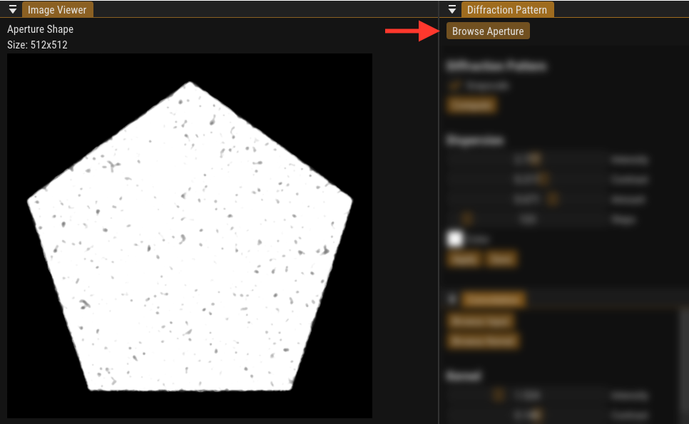
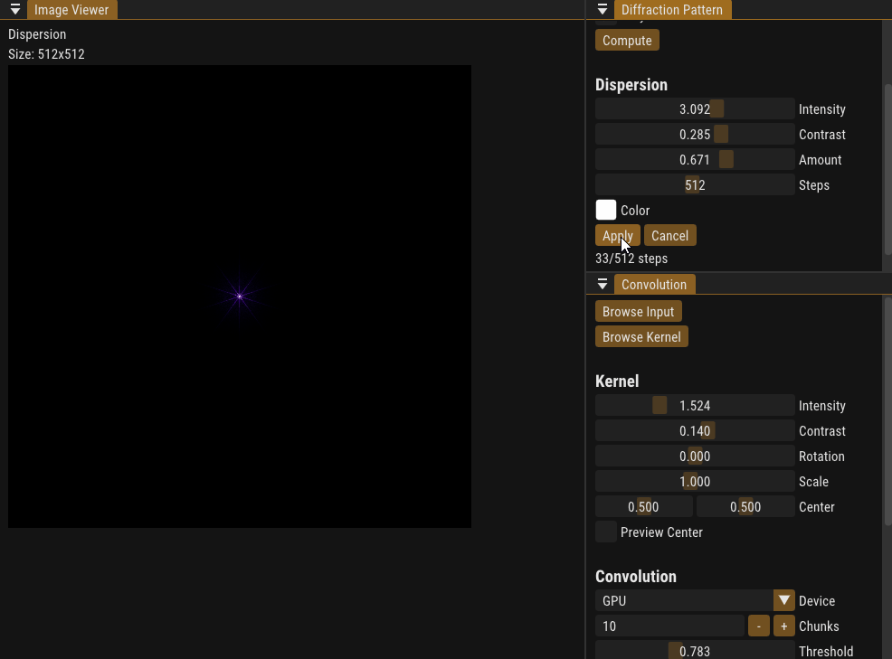
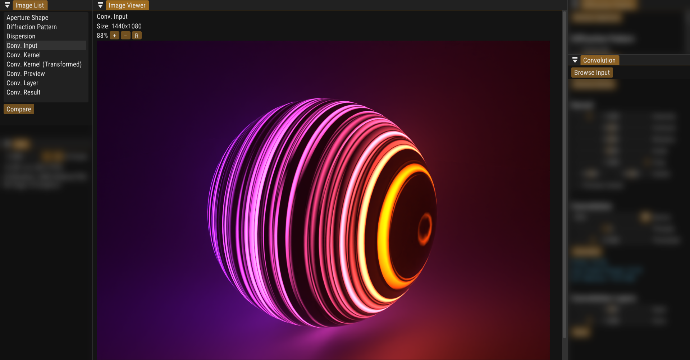
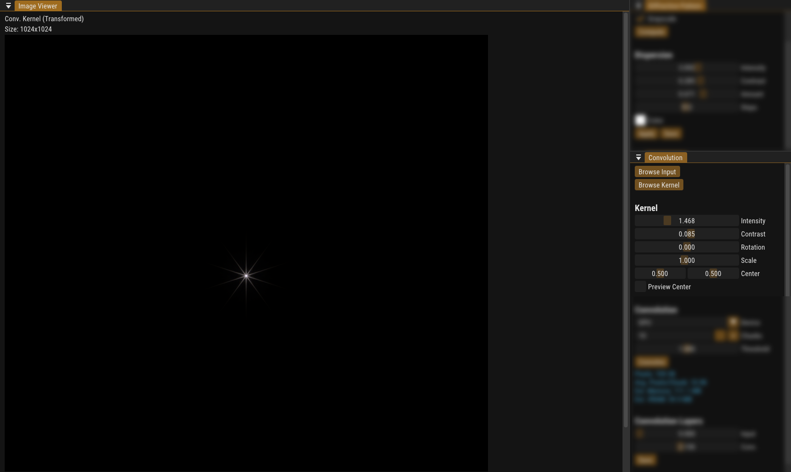
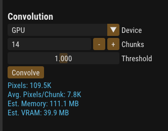
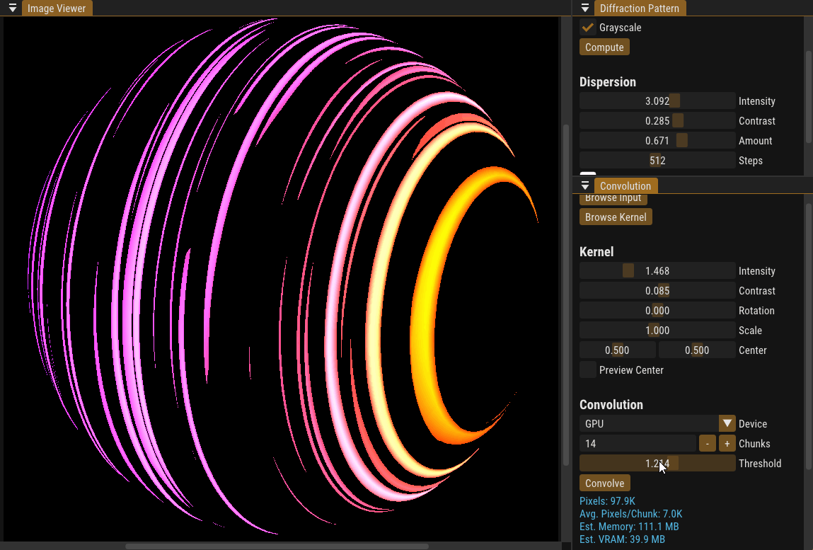

<!-- Improved compatibility of back to top link: See: https://github.com/othneildrew/Best-README-Template/pull/73 -->
<a name="readme-top"></a>
<!--
*** Thanks for checking out the Best-README-Template. If you have a suggestion
*** that would make this better, please fork the repo and create a pull request
*** or simply open an issue with the tag "enhancement".
*** Don't forget to give the project a star!
*** Thanks again! Now go create something AMAZING! :D
-->

<!-- PROJECT LOGO -->
<br />
<div align="center">
  <a href="https://github.com/bean-mhm/realbloom">
    
  </a>
<h3 align="center">RealBloom</h3>
  <p align="center">
    Physically Accurate Bloom Simulation
    <br />
    <a href="https://github.com/bean-mhm/realbloom/releases">Latest Release</a>
    ·
    <a href="https://github.com/bean-mhm/realbloom/issues">Report Bug</a>
    ·
    <a href="https://github.com/bean-mhm/realbloom/issues">Request Feature</a>
  </p>
</div>


<!-- TABLE OF CONTENTS -->
<details>
  <summary>Table of Contents</summary>
  <ol>
    <li>
      <a href="#introduction">Introduction</a>
      <ul>
        <li><a href="#what-i-used">What I used</a></li>
      </ul>
    </li>
    <li><a href="#running-realbloom">Running RealBloom</a></li>
    <li>
      <a href="#building-realbloom">Building RealBloom</a>
      <ul>
        <li><a href="#prerequisites">Prerequisites</a></li>
        <li><a href="#build">Build</a></li>
      </ul>
    </li>
    <li><a href="#usage">Usage</a></li>
    <li><a href="#roadmap">Roadmap</a></li>
    <li><a href="#contributing">Contributing</a></li>
    <li><a href="#license">License</a></li>
    <li><a href="#contact">Contact</a></li>
  </ol>
</details>


<!-- INTRODUCTION -->
## Introduction

RealBloom lets you simulate a more physically accurate bloom effect for your 3D renders, or any HDR image.

![RealBloom Screenshot][product-screenshot]


This project was inspired by [AngeTheGreat's video](https://www.youtube.com/watch?v=QWqb5Gewbx8) on bloom and how to simulate it. I recommend watching this video in order to have a basic understanding of how RealBloom works. Check out their [GitHub page](https://github.com/ange-yaghi)!

The ultimate goal of this project is to achieve more realism in 3D renders that contain extremely bright spots on dark backgrounds. For example, the sun in a blue sky, a car headlight at night-time, bright lights at a concert, or a flashlight pointing directly at the camera. You can learn about some other cool lens effects such as [Lens Flare](https://en.wikipedia.org/wiki/Lens_flare) and [Bokeh](https://en.wikipedia.org/wiki/Bokeh). If you're a blender user like myself, you might want to watch [this video](https://www.youtube.com/watch?v=UDvuhuU9tFg) on applying a custom bokeh effect in blender.

<p align="right">(<a href="#readme-top">back to top</a>)</p>


### What I used

RealBloom is written entirely in C++ with Visual Studio 2022. The target platform is exclusively Windows. However, considering the fact that all the libraries used and most of the code for RealBloom are platform-independent, it should be fairly easy to port it to another platform. I personally don't plan on doing that.

RealBloom uses the following libraries:
| Library | Used for |
|--|--|
| [FFTW](https://www.fftw.org/) | Generating diffraction pattern |
| [GLEW](https://glew.sourceforge.net/) | OpenGL extensions |
| [GLFW](https://www.glfw.org/) | Window and context creation for use in ImGui |
| [Dear ImGui](https://github.com/ocornut/imgui) | Graphical user interface |
| [LibTIFF](https://libtiff.gitlab.io/libtiff/) | Reading and writing TIFF image files |
| [LodePNG](https://lodev.org/lodepng/) | Reading and writing PNG image file |
| [NFD](https://github.com/mlabbe/nativefiledialog) | Native file dialogs |


<p align="right">(<a href="#readme-top">back to top</a>)</p>

<!-- RUNNING -->
## Running RealBloom

To run RealBloom, you need to have the [Visual C++ Runtime](https://learn.microsoft.com/en-us/cpp/windows/latest-supported-vc-redist?view=msvc-170) installed. A 64-bit version of the installer is included with every release build, in the `prerequisites` folder.

 - **Recommended specs:** To perform convolutional bloom, you need powerful hardware. I don't have exact lab numbers, but my recommendation would be to use a Windows 10/11 PC with a high-end GPU and a good amount of RAM. If you have a dedicated GPU, always use that for convolution, instead of the CPU.

 - **Minimum Requirements:** As for bare minimum requirements, make sure your GPU supports OpenGL 3.0 (for UI rendering). For GPU convolution, OpenGL 3.2 is required. A 64-bit version of Windows is required. I don't recommend using RealBloom on a system with less than 8 GB of RAM.

 - **My specs:** RealBloom runs fairly easily on my laptop with a Ryzen 7 3750H, and a GTX 1650, and 16 GB of RAM.

<p align="right">(<a href="#readme-top">back to top</a>)</p>


<!-- BUILDING -->
## Building RealBloom

You can follow these steps to build a local copy of this project.

### Prerequisites

To build RealBloom, you need a version of Visual Studio ready. The project was made for Windows and built with MSVC, so you're likely going to need a Windows system as well. See "Running RealBloom" for system requirements.

### Build

1. Clone the repo:
   ```sh
   git clone https://github.com/bean-mhm/realbloom.git
   ```

2. Open the solution `RealBloomCPP.sln` in Visual Studio.

3. *RealBloomCPP* is the main project, while *RealBloomGPUConv* is a "GPU Helper" that gets used by the main program. The GPU helper program `RealBloomGPUConv.exe` takes input buffers and parameters for GPU convolution in a file, performs convolution, then writes the result to an output file which will be read by `RealBloom.exe`.

4. Build the solution and run RealBloom. Feel free to explore and play with the code!

<p align="right">(<a href="#readme-top">back to top</a>)</p>


<!-- USAGE -->
## Usage

RealBloom lets you do 3 main things:

 1. Generate a **Diffraction Pattern** from an aperture shape.
 2. Apply **Dispersion** on the pattern.
 3.  Perform **Convolution** on an HDR image using the pattern.

The workflow is rather straightforward:

### Aperture

Load a PNG image that represents the geometric shape of the camera aperture. There are a bunch of example aperture shapes in the `demo` folder.


 
### Diffraction Pattern

Generate the diffraction pattern of the aperture. This is achieved by an [FFT algorithm](https://en.wikipedia.org/wiki/Fast_Fourier_transform), using [FFTW](https://www.fftw.org/).


### Dispersion

Apply dispersion on the diffraction pattern, as in the real world, the scale of the bloom pattern depends on the wavelength of light. Make sure to save the dispersion result.


 
### Convolution Input

Load an HDR image with bright spots on a relatively dark background. The input image must be in 32-bit floating-point [TIFF](https://en.wikipedia.org/wiki/TIFF) format, with contiguous component values (RGBRGB). You can easily save with this format using Photoshop. Blender does not support 32-bit TIFFs, but it does support OpenEXR. The simplest workaround is to export your render from Blender in OpenEXR format, then use Photoshop (or any other image manipulation software that supports 32-bit TIFFs) to export it in 32-bit floating-point TIFF format.



### Convolution Kernel

Load the dispersion result from before. This is what defines the "shape" of the bloom pattern. Convolution will be applied on the input image using this kernel. You can learn more about convolution [here](https://en.wikipedia.org/wiki/Kernel_%28image_processing%29). You can play with the transform sliders to adjust the intensity, contrast, rotation, scale, and the center point of the kernel.



### Convolution Device

This is where the job happens. Convolution can be done on CPU, or GPU. Like most other graphics-heavy things, convolution tends to run a lot faster on the GPU, as long as you own a relatively powerful dedicated GPU. On my GTX 1650, convolution runs 5-6 times faster on average, compared to my CPU.



### Threads 'n Chunks

In CPU mode, you can **split the job** between multiple **threads** that run simultaneously. Generally, the more cores your CPU has, the more threads you can use. Please don't maximize this number, as it can result in extreme slowdowns and potential crashes. On the other hand, you can use chunks in GPU mode. **Chunks split the input data** - which represent the bright pixels in your input image that pass the threshold - before giving it to the GPU. Sometimes the GPU can't handle the amount of data that it has to process, and ends up aborting the process and crashing the caller program. To get around this, we split the data into, say, 50 chunks. Each chunk only contains 1/50th of the input data. We give the first chunk to the GPU and ask it to process it. We get the output and add it (literally blend additively) to our final buffer. Then, we start an entirely new OpenGL context from scratch, and process the second chunk, and so on.

### Chunks and threads are not the same thing!

Each thread processes  a part of the input data *at the same time as all the other threads*. Chunks are processed *sequentially*, to reduce GPU load. Threads speed up the process by a noticeable amount, chunks may slow down the process by a minor amount, while helping us prevent the GPU from dying.

### Convolution Threshold

The lowest value a pixel can have, before being ignored by the convolution process.  We are basically skipping pixels that aren't bright enough to contribute to the final result, and unnecessarily slow down the process.


 
### Convolve!

After having loaded the input and kenrel images, and set all the parameters, hit this button and watch the convolution result as it's being rendered!

### Convolution Layers

Finally, you can mix the convolution layer and the original input image. In most cases, you will want to keep the input mix at 1.0, and only adjust the convolution mix. However, if you set the threshold to 0.0, you might want to set the input mix to 0.0, and adjust the convolution mix to your liking, this is because all the pixels in the input image will be processed, and there is no need to mix the convolution layer with the input image. Note that the two sliders use different curves.

### Compare and Save

After having the result that you like, you can use the "Compare" button to, well, *compare* the result and the input images. Then, click "Save" to export the convolution result in 32-bit floating-point TIFF format.


<p align="right">(<a href="#readme-top">back to top</a>)</p>


<!-- ROADMAP -->
## Roadmap

- [ ] A more sophisticated image viewer with zoom and pan controls
- [ ] Diffraction pattern generation from sequences, for animated aperture shapes
- [ ] Support for moving convolution kernels
- [ ] Convolution on animations and sequences
- [ ] OpenEXR support

See the [open issues](https://github.com/bean-mhm/realbloom/issues) for a full list of proposed features (and known issues).

<p align="right">(<a href="#readme-top">back to top</a>)</p>


<!-- CONTRIBUTING -->
## Contributing

Contributions are what make the open source community such an amazing place to learn, inspire, and create. Any contributions you make are **greatly appreciated**.

If you have a suggestion that would make this better, please fork the repo and create a pull request. You can also simply open an issue with the tag "enhancement".
Don't forget to give the project a star! Thanks again!

1. Fork the Project
2. Create your Feature Branch (`git checkout -b feature/AmazingFeature`)
3. Commit your Changes (`git commit -m 'Add some AmazingFeature'`)
4. Push to the Branch (`git push origin feature/AmazingFeature`)
5. Open a Pull Request

<p align="right">(<a href="#readme-top">back to top</a>)</p>


<!-- LICENSE -->
## License

Distributed under the [AGPL-3.0 license](https://github.com/bean-mhm/realbloom/blob/main/LICENSE.md). See `LICENSE.md` for more information.

<p align="right">(<a href="#readme-top">back to top</a>)</p>


<!-- CONTACT -->
## Contact

Harry Bean - [harry.bean.dev@gmail.com](mailto:harry.bean.dev@gmail.com)

Project Link: [https://github.com/bean-mhm/realbloom](https://github.com/bean-mhm/realbloom)

<p align="right">(<a href="#readme-top">back to top</a>)</p>


<!-- MARKDOWN LINKS & IMAGES -->
<!-- https://www.markdownguide.org/basic-syntax/#reference-style-links -->
[product-screenshot]: images/screenshot.png

