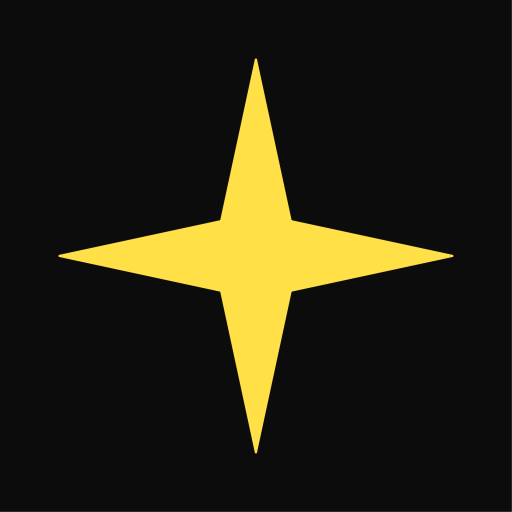

<!-- Improved compatibility of back to top link: See: https://github.com/othneildrew/Best-README-Template/pull/73 -->
<a name="readme-top"></a>
<!--
*** Thanks for checking out the Best-README-Template. If you have a suggestion
*** that would make this better, please fork the repo and create a pull request
*** or simply open an issue with the tag "enhancement".
*** Don't forget to give the project a star!
*** Thanks again! Now go create something AMAZING! :D
-->

<!-- PROJECT LOGO -->
<br />
<div align="center">
  <a href="https://github.com/bean-mhm/realbloom">
    
  </a>

<h3 align="center">RealBloom</h3>
  <p align="center">
    Physically Accurate Bloom Simulation for 3D Renders
    <br />
    <a href="https://github.com/bean-mhm/realbloom/releases">Latest Release</a>
    ·
    <a href="https://github.com/bean-mhm/realbloom/issues">Report Bug</a>
    ·
    <a href="https://github.com/bean-mhm/realbloom/issues">Request Feature</a>
  </p>
</div>


<!-- TABLE OF CONTENTS -->
<details>
  <summary>Table of Contents</summary>
  <ol>
    <li>
      <a href="#introduction">Introduction</a>
      <ul>
        <li><a href="#what-i-used">What I used</a></li>
      </ul>
    </li>
    <li><a href="#running-realbloom">Running RealBloom</a></li>
    <li>
      <a href="#building-realbloom">Building RealBloom</a>
      <ul>
        <li><a href="#prerequisites">Prerequisites</a></li>
        <li><a href="#build">Build</a></li>
      </ul>
    </li>
    <li><a href="#usage">Usage</a></li>
    <li><a href="#roadmap">Roadmap</a></li>
    <li><a href="#contributing">Contributing</a></li>
    <li><a href="#license">License</a></li>
    <li><a href="#contact">Contact</a></li>
  </ol>
</details>


<!-- INTRODUCTION -->
## Introduction

RealBloom lets you simulate a physically accurate bloom effect for your 3D renders, or any HDR image.
[![RealBloom Screenshot][product-screenshot]]

This project was inspired by [AngeTheGreat's video](https://www.youtube.com/watch?v=QWqb5Gewbx8) on bloom and how to simulate it. I recommend watching this video in order to have a basic understanding of how RealBloom works. Check out their [GitHub page](https://github.com/ange-yaghi)!

The ultimate goal of this project is to achieve more realism in 3D renders that contain extremely bright spots on dark backgrounds. For example, the sun in a blue sky, a car headlight at night-time, bright lights at a concert, or a flashlight pointing directly at the camera. You can learn about some other cool lens effects such as [Lens Flare](https://en.wikipedia.org/wiki/Lens_flare) and [Bokeh](https://en.wikipedia.org/wiki/Bokeh). If you're a blender user like myself, you might want to watch [this video](https://www.youtube.com/watch?v=UDvuhuU9tFg) on applying a custom bokeh effect in blender.

<p align="right">(<a href="#readme-top">back to top</a>)</p>


### What I used

RealBloom is written entirely in C++ with Visual Studio 2022. The target platform is exclusively Windows. However, considering the fact that all the libraries used and most of the code for RealBloom are platform-independent, it should be fairly easy to port it to another platform. I personally don't plan on doing that.

RealBloom uses the following libraries:
| Library | Used for |
|--|--|
| [FFTW](https://www.fftw.org/) | Generating diffraction pattern |
| [GLEW](https://glew.sourceforge.net/) | OpenGL extensions |
| [GLFW](https://www.glfw.org/) | Window and context creation for use in ImGui |
| [Dear ImGui](https://github.com/ocornut/imgui) | Graphical user interface |
| [LibTIFF](https://libtiff.gitlab.io/libtiff/) | Reading and writing TIFF image files |
| [LodePNG](https://lodev.org/lodepng/) | Reading and writing PNG image file |
| [NFD](https://github.com/mlabbe/nativefiledialog) | Native file dialogs |


<p align="right">(<a href="#readme-top">back to top</a>)</p>

<!-- RUNNING -->
## Running RealBloom

To run RealBloom, you need to have the [Visual C++ Runtime](https://learn.microsoft.com/en-us/cpp/windows/latest-supported-vc-redist?view=msvc-170) installed. A 64-bit version of the installer is included with every release build, in the `prerequisites` folder.

 - **Recommended specs:** To perform convolutional bloom, you need powerful hardware. I don't have exact lab numbers, but my recommendation would be to use a Windows 10/11 PC with a high-end GPU and a good amount of RAM. If you have a dedicated GPU, always use that for convolution, instead of the CPU.

 - **Minimum Requirements:** As for bare minimum requirements, make sure your GPU supports OpenGL 3.0 (for UI rendering). For GPU convolution, OpenGL 3.2 is required. A 64-bit version of Windows is required. I don't recommend using RealBloom on a system with less than 8 GB of RAM.

 - **My specs:** RealBloom runs fairly easily on my laptop with a Ryzen 7 3750H, and a GTX 1650, and 16 GB of RAM.

<p align="right">(<a href="#readme-top">back to top</a>)</p>


<!-- BUILDING -->
## Building RealBloom

You can follow these steps to build a local copy of this project.

### Prerequisites

To build RealBloom, you need a version of Visual Studio ready. The project was made for Windows and built with MSVC, so you're likely going to need a Windows system as well. See "Running RealBloom" for system requirements.

### Build

1. Clone the repo:
   ```sh
   git clone https://github.com/bean-mhm/realbloom.git
   ```

2. Open the solution `RealBloomCPP.sln` in Visual Studio.

3. *RealBloomCPP* is the main project, while *RealBloomGPUConv* is a "GPU Helper" that gets used by the main program. The GPU helper program `RealBloomGPUConv.exe` takes input buffers and parameters for GPU convolution in a file, performs convolution, then writes the result to an output file which will be read by `RealBloom.exe`.

4. Build the solution and run RealBloom. Feel free to explore and play with the code!

<p align="right">(<a href="#readme-top">back to top</a>)</p>


<!-- USAGE -->
## Usage

RealBloom lets you do 3 main things:

 1. Generate **Diffraction Pattern** from an aperture shape
 2. Apply **Dispersion** on the pattern
 3.  Perform **Convolution** on an HDR image using a kernel that could've been made with RealBloom

<p align="right">(<a href="#readme-top">back to top</a>)</p>


<!-- ROADMAP -->
## Roadmap

- [ ] Diffraction pattern generation from sequences, for animated aperture shapes
- [ ] Support for moving convolution kernels
- [ ] Convolution on animations and sequences

See the [open issues](https://github.com/bean-mhm/realbloom/issues) for a full list of proposed features (and known issues).

<p align="right">(<a href="#readme-top">back to top</a>)</p>


<!-- CONTRIBUTING -->
## Contributing

Contributions are what make the open source community such an amazing place to learn, inspire, and create. Any contributions you make are **greatly appreciated**.

If you have a suggestion that would make this better, please fork the repo and create a pull request. You can also simply open an issue with the tag "enhancement".
Don't forget to give the project a star! Thanks again!

1. Fork the Project
2. Create your Feature Branch (`git checkout -b feature/AmazingFeature`)
3. Commit your Changes (`git commit -m 'Add some AmazingFeature'`)
4. Push to the Branch (`git push origin feature/AmazingFeature`)
5. Open a Pull Request

<p align="right">(<a href="#readme-top">back to top</a>)</p>


<!-- LICENSE -->
## License

Distributed under the [AGPL-3.0 license](https://github.com/bean-mhm/realbloom/blob/main/LICENSE.md). See `LICENSE.md` for more information.

<p align="right">(<a href="#readme-top">back to top</a>)</p>


<!-- CONTACT -->
## Contact

Harry Bean - [harry.bean.dev@gmail.com](mailto:harry.bean.dev@gmail.com)

Project Link: [https://github.com/bean-mhm/realbloom](https://github.com/bean-mhm/realbloom)

<p align="right">(<a href="#readme-top">back to top</a>)</p>


<!-- MARKDOWN LINKS & IMAGES -->
<!-- https://www.markdownguide.org/basic-syntax/#reference-style-links -->
[product-screenshot]: images/screenshot.png

