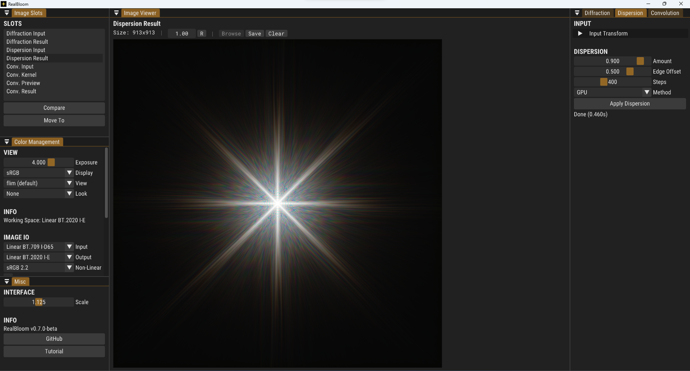

<!-- Improved compatibility of back to top link: See: https://github.com/othneildrew/Best-README-Template/pull/73 -->
<a name="readme-top"></a>
<!--
*** Thanks for checking out the Best-README-Template. If you have a suggestion
*** that would make this better, please fork the repo and create a pull request
*** or simply open an issue with the tag "enhancement".
*** Don't forget to give the project a star!
*** Thanks again! Now go create something AMAZING! :D
-->

<!-- PROJECT LOGO -->
<br />
<div align="center">
  <a href="https://github.com/bean-mhm/realbloom">
    
  </a>
<h3 align="center">RealBloom</h3>
  <p align="center">
    Bloom Simulation Software
    <br />
    <a href="https://github.com/bean-mhm/realbloom/releases">Latest Release</a>
    ·
    <a href="https://github.com/bean-mhm/realbloom/blob/main/docs/">Documentation</a>
    ·
    <a href="https://github.com/bean-mhm/realbloom/issues">Report Bug</a>
  </p>
</div>


<!-- TABLE OF CONTENTS -->
<details>
  <summary>Table of Contents</summary>
  <ol>
    <li><a href="#introduction">Introduction</a></li>
    <li><a href="#how-its-made">How It's Made</a></li>
    <li><a href="#how-to-run">How To Run</a></li>
    <li><a href="#how-to-use">How To Use</a></li>
    <li><a href="#how-to-build">How To Build</a></li>
    <li><a href="#roadmap">Roadmap</a></li>
    <li><a href="#contributing">Contributing</a></li>
    <li><a href="#license">License</a></li>
    <li><a href="#contact">Contact</a></li>
  </ol>
</details>


<!-- INTRODUCTION -->
# Introduction

RealBloom is a bloom simulation / post processing tool for achieving more realism in 3D renders and HDR images.




RealBloom was started as a hobby project in late August 2022, inspired by [AngeTheGreat's video](https://www.youtube.com/watch?v=QWqb5Gewbx8) on bloom and how to simulate it in a physically accurate manner. I highly recommend watching this video to get a basic understanding of how RealBloom works. Make sure to check out their [GitHub page](https://github.com/ange-yaghi) and their other projcets!

The ultimate goal of bloom is to achieve more realism in 3D renders that contain bright spots on dark backgrounds. For example, the sun in a blue sky, a car headlight at night, bright lights at a concert, a flashlight pointing directly at the camera, you name it.

RealBloom can be used to produce some other effects, including film halation, motion blur with arbitrary curves, uniform lens blur, etc. These, and more, can be achieved with the three main modules in RealBloom:

- Diffraction (2D FFT)
- Dispersion
- Convolution

# How It's Made

RealBloom is written in C++ with Visual Studio 2022. The target platform is Windows. However, considering all the libraries used and most of the code for RealBloom are platform-independent, it should be fairly easy (ish) to port to other major desktop platforms.

## Libraries Used
| Library | Used for |
|--|--|
| [GLEW](https://glew.sourceforge.net/) | OpenGL extensions |
| [GLFW](https://www.glfw.org/) | Window and context creation |
| [Dear ImGui](https://github.com/ocornut/imgui) | Graphical user interface |
| [NFD Extended](https://github.com/btzy/nativefiledialog-extended) | Native file dialogs |
| [OpenColorIO](https://opencolorio.org/) | Color management |
| [OpenImageIO](https://github.com/OpenImageIO/oiio) | Reading and writing images |
| [PocketFFT](https://github.com/mreineck/pocketfft) | 2D Fast Fourier Transforms |
| [dj_fft](https://github.com/jdupuy/dj_fft) | 2D FFT on the GPU |
| [pugixml](https://pugixml.org/) | Parsing and serializing XML files |
| [Rapidcsv](https://github.com/d99kris/rapidcsv) | Parsing CSV files |

<p align="right">(<a href="#readme-top">back to top</a>)</p>


<!-- RUNNING -->
# How To Run

RealBloom requires [Microsoft Visual C++ Runtime](https://learn.microsoft.com/en-us/cpp/windows/latest-supported-vc-redist?view=msvc-170) in order to run properly. To get RealBloom, you can [download the latest release here](https://github.com/bean-mhm/realbloom/releases).

## Minimum Requirements

 - 64-bit version of Windows

 - 4 GB of RAM

 - GPU with OpenGL 3.2 support

<p align="right">(<a href="#readme-top">back to top</a>)</p>


<!-- USAGE -->
# How To Use

If you're using RealBloom for the first time, check out [this step-by-step tutorial][tutorial] on getting started with RealBloom, along with more details and information about the project. This will cover most of what you need to know.

<p align="right">(<a href="#readme-top">back to top</a>)</p>


<!-- BUILDING -->
# How To Build

## Prerequisites

The project was made for Windows and built with MSVC. To build a local copy of RealBloom, have a recent version of Visual Studio ready.

RealBloom uses [vcpkg](https://vcpkg.io/en/index.html) to link some of the libraries, specifically, [OpenColorIO](https://opencolorio.org/) and [OpenImageIO](https://github.com/OpenImageIO/oiio). Here are the basic steps to install vcpkg and the mentioned libraries.

1. Follow the [vcpkg installation instructions](https://github.com/Microsoft/vcpkg#quick-start-windows) to install vcpkg and **enable Visual Studio integration**.

2. Run the following command from vcpkg's root directory:
   ```sh
   vcpkg install openimageio[opencolorio,tools]:x64-windows --recurse
   ```

Note that this might take some time to finish.

## Build

Now, to build RealBloom,

1. Clone the repo:
   ```sh
   git clone https://github.com/bean-mhm/realbloom.git
   ```

2. Open `RealBloom.sln` in Visual Studio.

3. Build the solution and run `RealBloom.exe`. Feel free to explore and play with the code!

<p align="right">(<a href="#readme-top">back to top</a>)</p>


<!-- ROADMAP -->
# Roadmap

- [x] Color Management System
- [x] OpenEXR support
- [x] Command Line Interface
- [x] GPU Dispersion
- [ ] [WIP] GPU FFT Convolution
- [ ] GPU Image Transforms
- [ ] ~~Node-based workflow~~
- [ ] ~~Support for animated apertures, kernels and input images~~ 
- [ ] ~~GPU Diffraction Pattern~~

See [open issues](https://github.com/bean-mhm/realbloom/issues) for a full list of proposed features (and known issues).

<p align="right">(<a href="#readme-top">back to top</a>)</p>


<!-- CONTRIBUTING -->
# Contributing

Contributions are what make the open source community such an amazing place to learn, inspire, and create. Any contributions you make are **greatly appreciated**.

If you have a suggestion that would make this better, please fork the repo and create a pull request. You can also simply open an issue with the tag "enhancement".
Don't forget to give the project a star! Thanks again!

1. Fork the Project
2. Create your Feature Branch (`git checkout -b feature/AmazingFeature`)
3. Commit your Changes (`git commit -m 'Add some AmazingFeature'`)
4. Push to the Branch (`git push origin feature/AmazingFeature`)
5. Open a Pull Request

<p align="right">(<a href="#readme-top">back to top</a>)</p>


<!-- LICENSE -->
# License

Distributed under the [AGPL-3.0 license](https://github.com/bean-mhm/realbloom/blob/main/LICENSE.md). See [LICENSE.md](LICENSE.md) for more information.

<p align="right">(<a href="#readme-top">back to top</a>)</p>


<!-- CONTACT -->
# Contact

☀️ **RealBloom Community Server:** [Discord](https://discord.gg/Xez5yec8Hh)

🧑‍💻 **Harry Bean (Developer):** [Email](mailto:harry.bean.dev@gmail.com)

🔗 **Project Link:** [GitHub](https://github.com/bean-mhm/realbloom)

<p align="right">(<a href="#readme-top">back to top</a>)</p>


<!-- MARKDOWN LINKS & IMAGES -->
<!-- https://www.markdownguide.org/basic-syntax/#reference-style-links -->
[product-screenshot]: images/screenshot.png
[tutorial]: https://github.com/bean-mhm/realbloom/blob/main/docs/v0.7.0-beta/tutorial.md
