## Getting Started

RealBloom provides 3 main functionalities:

 1. Computing the **Diffraction Pattern** of an aperture
 2. Applying **Dispersion** on the pattern
 3. Performing **Convolution** on an HDR image using the pattern

If any or all of these terms sound scary, fear not, as they'll be explained briefly.

Below we'll go through the process of applying convolutional bloom on an HDR image. Run the [latest release](https://github.com/bean-mhm/realbloom/releases) of RealBloom and follow these steps.

## Interface

RealBloom's interface is rather simple, and there's only a single main window that provides everything we need. Let's see how the user interface is laid out.

As of now, there are 5 panels for different purposes. Each panel can be docked or floating, you can also resize the panels.

 - Starting from top left, we have *Image List*. This is a static list of image slots that RealBloom uses. You can switch to another slot by clicking on it. We'll go through what each slot is used for later.
 - Below the *Image List*, there's *Info*. This panel displays miscellaneous information.
 - In the middle we have our *Image Viewer*, which displays the buffer contained in the selected image slot.
 - Last but not least, we have two important panels on the right. We'll go through what each panel is used for below.

## Aperture

An [aperture](https://en.wikipedia.org/wiki/Aperture) defines the shape of the hole through which light passes to reach the camera sensor. Because of light's wave-like properties, this causes a diffraction pattern to form, which affects all the images taken by the camera. We'll talk more about this, but let's start by loading a PNG image that represents the geometric shape of our aperture. Click *Browse Aperture* in the top right panel *Diffraction Pattern*. There are a bunch of example aperture shapes in `demo/Apertures` ready for you. I will be using `Hexagon.png`.

 
## Diffraction Pattern

Let's see what the diffraction pattern of our aperture looks like. If this term is new and/or confusing, you can learn more [here](https://en.wikipedia.org/wiki/Diffraction), also make sure to watch the first video mentioned in the <a href="https://github.com/bean-mhm/realbloom#introduction">introduction</a>. Keep in mind that we are talking about the far-field [Fraunhofer diffraction pattern](https://en.wikipedia.org/wiki/Fraunhofer_diffraction). Now, let's continue by clicking on *Compute*. This will generate the diffraction pattern using an [FFT algorithm](https://en.wikipedia.org/wiki/Fast_Fourier_transform) provided by the [FFTW](https://www.fftw.org/) library.

> Notice how the selected slot in the *Image List* has changed to *Diffraction Pattern*. Keep an eye on this list and see how it changes as we continue.

> The *Grayscale* checkbox can be enabled for color images, in order to make the image black-and-white before feeding it to FFTW. If disabled, FFT will be performed on each color channel.

## Dispersion

In the real world, the scale of the pattern depends on the wavelength of light, making it appear colorful and "rainbow-ey". We can simulate [this phenomenon](https://en.wikipedia.org/wiki/Dispersion_%28optics%29) in RealBloom. Here's what each slider in the *Dispersion* section does:

| Parameter | Effect |
|--|--|
| Intensity | Multiplier of the diffraction pattern. This value is transformed by the <a href="#intensity-curve">Intensity Curve</a>. |
| Contrast | Contrast of the diffraction pattern. A value between 0.1 - 0.3 is usually enough. See <a href="#contrast-curve">Contrast Curve</a> for more info. |
| Amount | Amount of dispersion. This is a linear value between 0 and 1 that affects the smallest scale. A normal range would be 0.3 - 0.6. |
| Steps | Number of wavelengths to sample from the visible light spectrum. A value of 32 is only enough for previewing. For a final result, use a higher value. |
| Color | Multiplies the dispersion result with a custom color. You would want to keep this at white in most cases, having no effect on the result, but feel free to experiment with it. |

After adjusting the sliders to your liking, hit *Apply* and wait for the simulation to end, after which you'll see the *Save* button. Save the final result as `kernel.tif`. We'll use this later.

https://user-images.githubusercontent.com/98428255/193821817-4d488d7a-b2f1-45ac-9795-d80464a27890.mp4
 
## Convolution Input

This is the image we want to apply bloom on. RealBloom requires an HDR image in a 32-bit floating-point [TIFF](https://en.wikipedia.org/wiki/TIFF) format, with contiguous component values (RGBRGB). You can easily save with this format using Photoshop. [Blender](https://blender.org/) does not support 32-bit TIFFs, but it does support OpenEXR. The simplest workaround is to export your render from Blender in OpenEXR, and use Photoshop - *or any other image manipulation software that supports 32-bit OpenEXR and TIFF* - to export it in the required format.

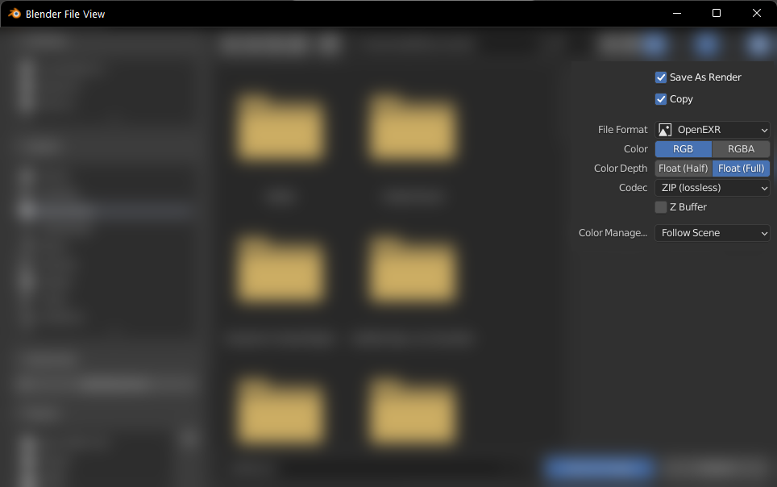

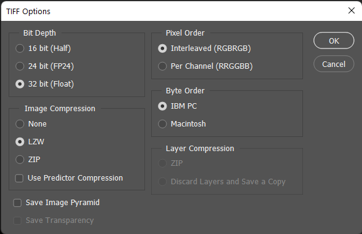

***What do you mean by an "HDR" image?*** Most everyday images (including PNG and JPEG images) do not have a high dynamic range, and their RGB values are clamped between 0 and 1, making it impossible to apply bloom accurately. An HDR image can contain color values higher than 1 to represent bright spots. Image formats like TIFF and OpenEXR allow us to save the RGB values as floating-point numbers that don't really have a range. Values higher than 1 *usually* get clamped down to 1 before being displayed on your monitor. Some games/programs use [Tone Mapping](https://en.wikipedia.org/wiki/Tone_mapping) to nicely transform the raw floating-point values into something that looks more accurate. Some games can produce HDR output if your monitor supports it, but that's another story. Despite the RGB values being clamped/clipped when *displayed*, they are still *stored* as floating-point values, making effects like bloom possible.

In the *Convolution* panel, click on *Browse Input* and select an HDR image. I have included some example images in `demo/HDR Images`. For this demonstration, I will use `Colorful Sphere.tif` which is a render I made in Blender.

> Bloom works best on scenes with extremely bright spots on dark backgrounds. Applying bloom on low-contrast or flat images may take away from the realism.

## Convolution Kernel

The kernel is what defines the "shape" of the bloom pattern. Convolution will be applied on the input image using this kernel.

***What is Convolution?*** Simply put, for every single bright pixel in the input image, we take the kernel, multiply it with the color of that pixel, and draw it in the convolution layer at the pixel's location using [additive blending](https://en.wikipedia.org/wiki/Blend_modes#:~:text=The-,Linear%20Dodge,-blend%20mode%20simply). This is as literal as it gets. Convolution is mostly used for effects such as blurring and sharpening, in which the kernel is usually really small. A blur kernel could be as small as 3x3. In convolutional bloom, however, we use RGB kernels that are much larger as well, which explains why it is slower than most other convolution-based effects. You can learn more about convolution [here](https://en.wikipedia.org/wiki/Kernel_%28image_processing%29).

Click on *Browse Kernel* and choose `kernel.tif`. This will switch the current slot to *Conv. Kernel (Transformed)*, which contains the normalized and transformed version of the kernel. You can see the original image in *Conv. Kernel*.

> The kernel doesn't necessarily have to be a diffraction pattern. You can use anything as the kernel, so definitely try experimenting with it.

Let's see what each slider in the *Kernel* section does.
| Parameter | Effect |
|--|--|
| Intensity | Multiplier of the kernel image. A value between 1 and 2 is usually enough. This value is transformed by the <a href="#intensity-curve">Intensity Curve</a>. |
| Contrast | Contrast of the kernel. A value between 0.1 - 0.3 is usually enough. See <a href="#contrast-curve">Contrast Curve</a> for more info. |
| Rotation | Rotation of the kernel in degrees. |
| Scale | Scale of the kernel. This value resizes the kernel buffer uniformly. |
| Crop | Amount of cropping. A value of 1 will have no effect, while a value lower than 1 will crop the kernel from the center point. |
| Center | The center point of the kernel. Adjusting this will shift the convolution layer and affect how the kernel is cropped. You don't need to change this in most cases, as the pattern is usually at the center (0.5, 0.5). |
| Preview Center | If enabled, the center point will be marked. |

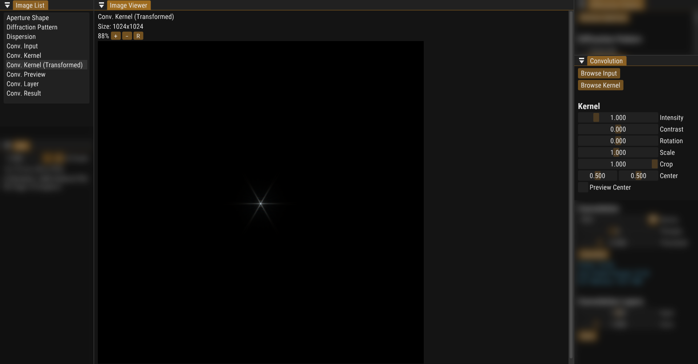

You'll notice that my kernel looks way darker now. This is because the kernel has been normalized, meaning that the brightest color value is now 1. We will change that later by using the *Intensity* slider, but for now we'll crop the kernel using the *Crop* slider. Let's see why.

The size of the kernel has a huge effect on the performance of convolution. A kernel buffer of size 1000x1000 has four times more pixels than a buffer of size 500x500, and keep in mind that the kernel will have to be drawn on every single pixel in the input image that passes the convolution threshold, which could be hundreds of thousands of pixels. This, and the fact that most off-center parts of the kernel aren't bright enough to contribute to the final result, is why we crop the kernel. I will set my crop amount to 0.5 for now.

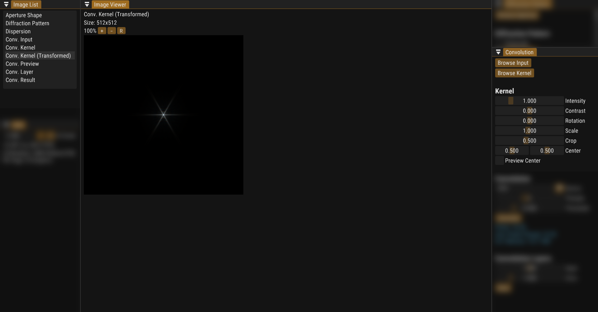

Let's maximize the kernel intensity to make sure that we don't crop the kernel too much.

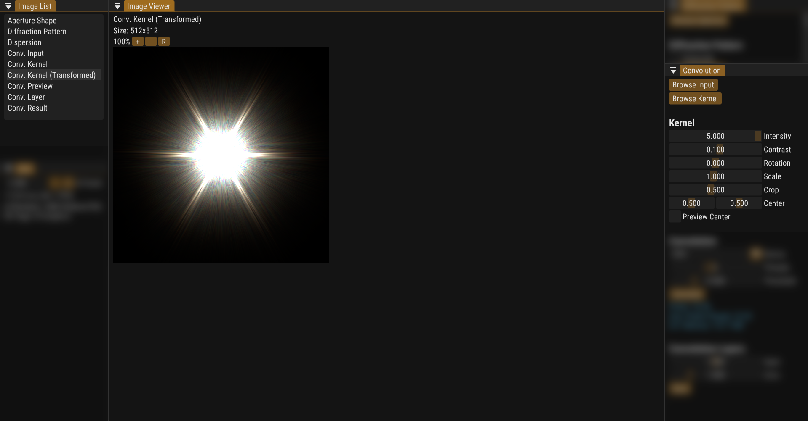

As we can see, the pattern fits pretty well after being cropped. Now, let's talk about contrast. Reset the crop amount and the contrast, then type in 7 for the intensity.

> You can hold *Ctrl* and click on a slider in order to type in a custom value. Some sliders have hard-coded minimum and/or maximum values.

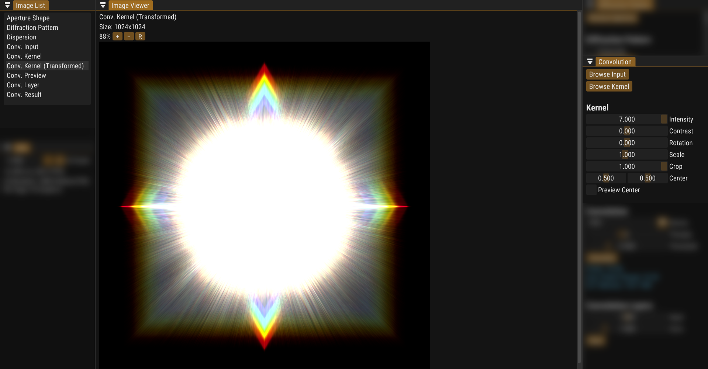

We see a strange square pattern appear. This is because there's always *some* amount of noise in every part of the diffraction pattern, and if we make it bright enough, we can see it properly. Keep in mind that the intensity value 7 gets transformed to a huge number - a million units - by the <a href="#intensity-curve">Intensity Curve</a>. Regardless, we can increase the contrast to make the square go away.

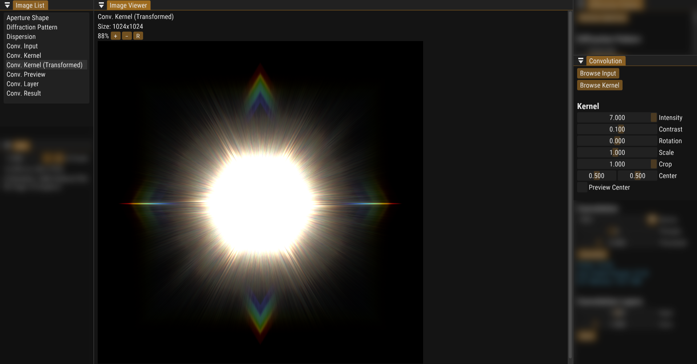

There's no easy way to determine the right amount for the contrast. As long as the noise and the halo around the main pattern - the star pattern in my case - are noticeably darker than the pattern itself, and it "matches" the contrast of the input image, you should be good.

Let's finalize our kernel and move on to the next part. I will be using the following values:

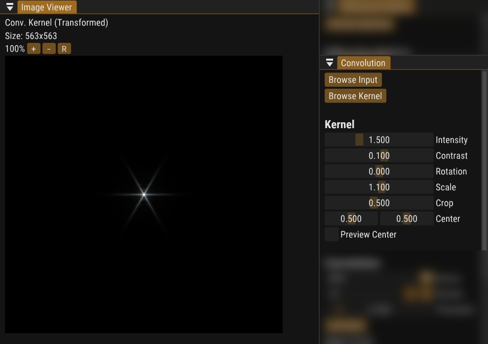

## Convolution Device

Convolution can be done on the CPU or the GPU, but like most graphics-heavy applications, it tends to run significantly faster on the GPU. In my case, convolution runs 5-6 times faster on the GPU.

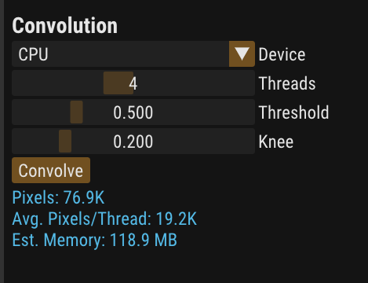
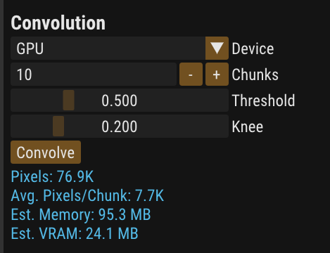

If you have a dedicated GPU, you should use it for convolution. Otherwise, choose CPU. We'll go through the other parameters in a minute.

### Threads 'n Chunks

In CPU mode, you can **split the job** between multiple threads that run simultaneously. Generally, the more cores your CPU has, the more threads you can use. Don't maximize the number of threads, as it can result in extreme slowdowns and potential crashes.

You can use chunks in GPU mode. Chunks **split the input data** before giving it to the GPU. Sometimes the GPU can't handle the amount of data that it has to process, and ends up aborting the process and crashing the caller program. To get around this, we split the data into *n* chunks. Each chunk contains *1/nth* of the input data. We give the first chunk to the GPU and ask it to process it. We get the output and add it to our final buffer. Then, we create a new OpenGL context from scratch, and process the second chunk, and so on.

### They're not the same thing!

Threads and chunks might sound similar, but the way they work is entirely different.

| Threads | Chunks |
|--|--|
| Each thread processes  a part of the input data *at the same time as all the other threads*.  | Chunks are processed *sequentially*, to reduce GPU load. |
| Threads speed up the process by a noticeable amount. | Chunks may slow down the process by a minor amount, while helping us avoid GPU crashes. |

## Convolution Threshold

The darkest a pixel can go before being ignored by the convolution process.  We are skipping pixels that aren't bright enough to contribute to the final result, in order to speed up the process. The *Knee* parameter defines how smooth the transition will be.

https://user-images.githubusercontent.com/98428255/194399748-6de4278d-5a60-4eb1-ad44-d307f0a2a622.mp4

You can apply convolution on every single pixel in the input image, but doing so slows down the process by a huge amount. You can still set the threshold and the knee to 0 and not mix the convolution layer with the input image. This can generate interesting results if done correctly.

> Pixels that are fully black (0, 0, 0) will always be ignored, unless the threshold is negative.

## Resource Usage

We can see a block of text in blue in the *Convolution* section. This provides us with some important information that we can use before starting the convolution process:

| Data | Meaning |
|--|--|
| Pixels | Number of pixels in the input image that pass the threshold |
| Avg. Pixels/Thread | Average number of pixels each thread will process |
| Avg. Pixels/Chunk | Average number of pixels each chunk will contain |
| Est. Memory | Estimated amount of memory needed |
| Est. VRAM | Estimated amount of video memory needed |

In CPU mode, there's not much concern about the number of pixels/thread, and you only need to keep an eye on the memory usage. By default, the number of threads is set to be half the number of concurrent threads supported by your CPU. Maximizing the number of threads is not recommended, but you can play with this number and see how it affects the time it takes to finish convolution.

In GPU mode, we care about the number of pixels/chunk. This affects the amount of data that the GPU will have to process at a time. In my case, I find values around 10k to be the safe spot. The threshold and the number of chunks both affect this number.

Keep in mind that the size of the kernel buffer also has an impact on whether the GPU will be able to keep up or not. If GPU convolution fails, try increasing the number of chunks. This is an arbitrary number, meaning you can have 1 chunk, 50 chunks, or 1000 chunks. Having a crazy number of chunks can slow down the process because of the repetitive creation and deletion of OpenGL contexts.

### Dual-GPU Systems

If you own a laptop with two GPUs - *typically an integrated one for everyday use and a dedicated GPU for graphics-heavy applications and gaming* - you might be wondering which one gets used for convolution. To answer that, let's start by explaining how GPU convolution is done in RealBloom.

When doing GPU convolution, RealBloom creates a temporary file and writes the input and kernel buffers, as well as the convolution parameters into the file. It then executes its GPU helper program `RealBloomGPUConv.exe` and passes the filename as an argument. The GPU helper performs convolution and pours the result into another temporary file which gets read by RealBloom. The GPU helper also creates a `stat` file and writes the progress into it. That way we can watch the convolution process in RealBloom as it's happening. The temporary files all get deleted, but there's one file that the GPU helper creates and doesn't delete... That is the log file.

After performing GPU convolution, you can check out your `%TEMP%` folder, sort by modified and look for the most recent text file that starts with `gpuconv`, an example would be `gpuconv1113518818log.txt`. I'll open the latest log file in my case and read the contents:

We can see exactly how many pixels (points) each chunk contained, how the stat file was written, and some other information about the process. Most importantly, we can see the "Renderer" that was used. In my case, the GPU helper indeed used my dedicated GPU rather than the integrated one. But how?

There's no official way to switch between GPU devices using OpenGL on Windows. However, we can "signal" to NVIDIA and AMD drivers that "this program needs the high-performance GPU". RealBloom's main program `RealBloom.exe` does not contain this signal, but the GPU helper `RealBloomGPUConv.exe` does. This makes RealBloom easy to work with on most Dual-GPU systems, as the UI continues to render smoothly, while the dedicated GPU is busy.

If the GPU helper isn't using the desired GPU, visit **Windows Settings > System > Display > Graphics**  to change the default/preferred GPU for `RealBloomGPUConv.exe`. This might differ if you're using an older version of Windows.
 
## Convolve, Mix, Compare

After having loaded the input and kenrel images, and set all the parameters, hit this button and watch the convolution result as it's being rendered! I will use the following parameters:

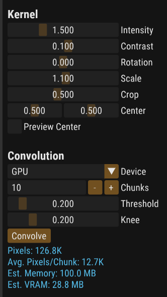

When the process is done, we mix the convolution layer and the original input image using [additive blending](https://en.wikipedia.org/wiki/Blend_modes#:~:text=The-,Linear%20Dodge,-blend%20mode%20simply) in the *Layers* section. The final result will be shown in the bottom-most slot *Conv. Result*. In most cases, you will want to keep the input mix at 1.0, and only adjust the convolution mix. However, if you set the threshold to 0.0, you might want to set the input mix to 0.0 and adjust the convolution mix to your liking. This is because all the pixels in the input image will have been processed, and there is no need to mix the convolution layer with the input image.

> The sliders in *Layers* use different transformaions. The input mix acts as a linear multiplier, while the convolution layer mix follows the <a href="#intensity-curve">Intensity Curve</a>.

After having the result that you like, use the *Compare* button to compare *Conv. Result* and *Conv. Input*. Finally, you can hit *Save* to export the result in a 32-bit TIFF.

https://user-images.githubusercontent.com/98428255/194543945-c0917b9a-82fd-4a52-bbac-465cb3fb1f72.mp4

## Curves in RealBloom

### Intensity Curve

The intensity curve transforms a positive input value of `x` according to the following function.

<!-- Why is it such a pain to use SVGs or math expressions in GitHub -->
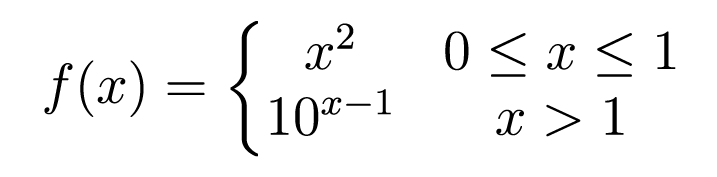
<!--
f(x)= \left\{\begin{matrix}
x^{2} & 0\leq x\leq 1 \\ 
10^{x-1} & x > 1
\end{matrix}\right.
-->

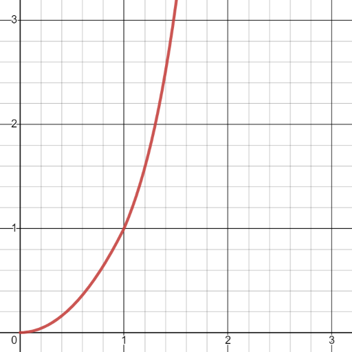

Let's plug in some numbers and see how the result changes.

| Input | Output |
|--|--|
| 0.00 | 0.00 |
| 0.50 | 0.25 |
| 1.00 | 1.00 |
| 2.00 | 10.0 |
| 3.00 | 100 |
| 4.00 | 1000 |
| 5.00 | 10000 |

### Contrast Curve

The contrast curve changes based on the contrast value:

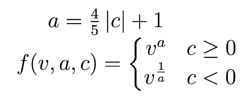
<!--
a=\frac{4}{5}\left|c\right|+1
\newline
f(v, a, c)=\left\{\begin{matrix}
v^{a} & c\ge0 \\ 
v^{\frac{1}{a}} & c<0
\end{matrix}\right.
-->

Where ${v}$ is the brightness of a single pixel in a normalized buffer, ${c}$ is 3 times the amount of contrast, and $f(v, a, c)$ is the contrast function.

https://user-images.githubusercontent.com/98428255/193428969-f2e550ac-16a2-4edb-b8d7-75876de0ab06.mp4

## The Wrong Way

Despite this being a project for simulating physics phenomena, you can get really weird and artistic with the parameters and achieve some creative results. My advice is to definitely try out some unusual settings and see what you can make. You can use an irrelevant image as the kernel, play with the dispersion color, use an unfitting image as the aperture shape, etc.

## Community

If you use RealBloom on your artwork, or make an entire artwork using RealBloom, feel free to publish it on Twitter or Instagram under #realbloom.

## Thank You!

If you find RealBloom useful, please consider introducing it to a friend or anyone who you think would be interested. I really appreciate you for spending time reading this, have a bloomy day!

## Read More

 - [Convolutional Bloom in Unreal Engine](https://docs.unrealengine.com/5.0/en-US/bloom-in-unreal-engine/#bloom-convolution:~:text=%235-,Bloom%20Convolution,-The%20Bloom%20Convolution)
