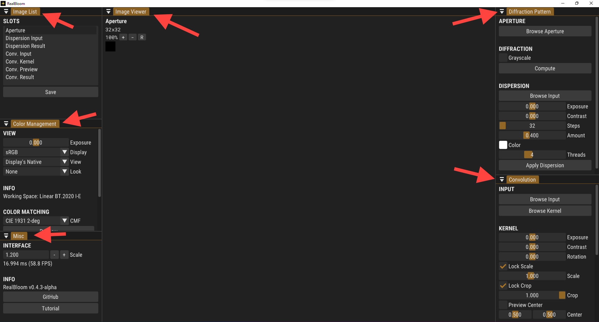
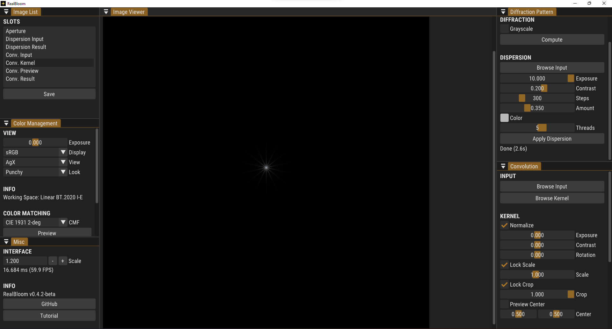
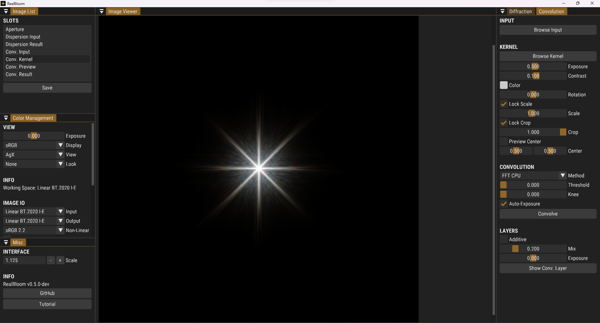
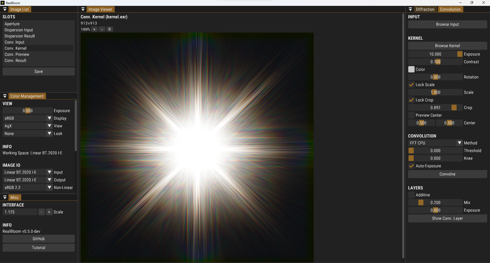
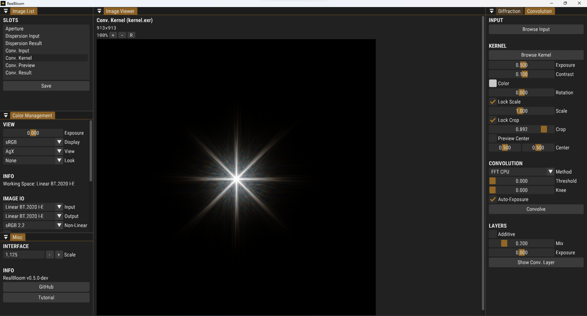
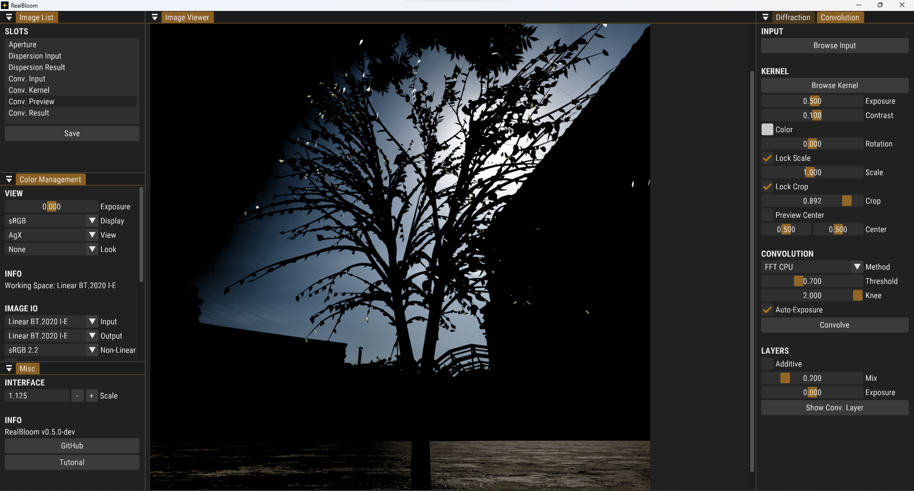

# Quick Start

This tutorial intends to get your hands on RealBloom as quickly as possible. Below we'll go through the process of applying convolutional bloom - A.K.A. the super cool physically accurate realistic bloom sauce -  on an HDR image. So buckle up, run the [latest release](https://github.com/bean-mhm/realbloom/releases) of RealBloom, and let's get started.

## Wait

First off, I highly suggest you watch [this video](https://www.youtube.com/watch?v=QWqb5Gewbx8) by AngeTheGreat, if you want to have a general idea of what we're gonna do in this tutorial, and how RealBloom works.

## Getting Started

RealBloom provides 3 main functionalities, in order to achieve the so-called physically accurate bloom effect.

 1. Simulating the **Diffraction Pattern** of an aperture
 2. Applying **Dispersion** on the pattern
 3. Performing **Convolution** on an HDR image

If any or all of these terms sound alien to you, fear not, as they'll be explained below.

## Interface

We'll start by observing the user interface. RealBloom's interface is rather simple, and there's only a single main window that provides everything we need. Let's see how everything is laid out.

As of now, there are 6 panels, each for a specific purpose. A panel can be docked or floating, and you can also resize it to your liking.

 - **Image List**: This is a static list of image slots that serve different purposes. You can switch to another slot by clicking on it. We'll go through what each slot is used for later.

 - **Color Management**: We'll use this panel to change how we view images, as well as some options that'll come handy when simulating dispersion.

 - **Misc**: This panel displays miscellaneous information, as well as a slider for the UI scale, which you can adjust if the interface is too small or too big.

 - **Image Viewer**:  This panel displays the image contained in the current slot.

- **Diffraction Pattern**: We'll use this to generate the light diffraction pattern of an aperture, and to apply dispersion on it. Again, don't worry if this seems a bit confusing to you.

- **Convolution**: This is where we can apply the bloom effect. We can do lots of other things using convolution, so it's not necessarily limited to bloom.

## Aperture

An [aperture](https://en.wikipedia.org/wiki/Aperture) defines the shape of the hole through which light passes to reach the camera sensor. Because of light's wave-like properties, this causes a [diffraction](https://en.wikipedia.org/wiki/Diffraction) pattern to form, which affects all the images taken by the camera. The diffraction pattern usually looks like a star with a halo around it, but it depends on the shape of the aperture. This is what makes stars have *the star shape* in the first place.

Let's start by loading an image that represents the geometric shape of our aperture. Click *Browse Aperture* in the top right panel *Diffraction Pattern*. There are a bunch of example aperture shapes in `demo/Apertures` ready for you. I will be using `Heptagon.png`.

> You'll be prompted to choose a color space after opening an image file. For now, just hit *OK* and continue.

 
## Diffraction

Let's see what the diffraction pattern of our aperture looks like. We'll continue by clicking on *Compute* in the *DIFFRACTION* section. This will generate the diffraction pattern using an [FFT algorithm](https://en.wikipedia.org/wiki/Fast_Fourier_transform). Keep in mind that we are referring to the far-field [Fraunhofer diffraction pattern](https://en.wikipedia.org/wiki/Fraunhofer_diffraction) here.

> The *Grayscale* checkbox can be enabled for color images, in order to make the image black-and-white before feeding it to the FFT algorithm. If disabled, FFT will be performed on all color channels separately.

I've increased my view exposure in the *Color Management* panel so that we can see the image properly. As you can see, this is a star with 14 blades, double the number of sides! You can experiment and see how this relation differs for other regular polygons.

Notice how the selected image slot has changed to *Dispersion Input*. We could use any arbitrary image as the dispersion input, but the diffraction pattern automatically gets loaded into this slot.

## Dispersion

Our little star pattern isn't quite ready to be used yet. In the real world, the scale of the pattern depends on the wavelength of the light, making it appear colorful and "rainbow-ey". We can simulate [this phenomenon](https://en.wikipedia.org/wiki/Dispersion_%28optics%29) in the *DISPERSION* section. Here's what each slider does:

| Parameter | Effect |
|--|--|
| Exposure | Exposure of the input |
| Contrast | Contrast of the input |
| Steps | Number of wavelengths to sample from the visible light spectrum. A value of 32 is only enough for previewing. For a final result, use a higher value. |
| Amount | Amount of dispersion. This is a linear value between 0 and 1 which affects the smallest scale. A normal range would be 0.3 - 0.6. |
| Color | Multiplies the dispersion result with a custom color. You would want to keep this at white in most cases. |
| Threads | Number of CPU threads to use  |

After adjusting the sliders to your liking - or copying the values from the screenshot below - hit *Apply Dispersion* and wait for the simulation to end.

Now, hit *Save* in the *Image List* panel, and save the dispersion result as `kernel.exr`, or whatever else. You'll once again be asked to choose a color space, which the image will be saved in. Choose `Linear BT. 2020 I-E` and hit *OK*. "BT. 2020" has a wide color gamut which can represent really saturated chromaticities that can't be represented in the usual "Rec. 709" and sRGB gamut.

> I know these color space stuff may seem confusing or scary to some readers, so I've included links to some really helpful articles about color science at the end, written by experienced people in the industry.
 
## Convolution Input & HDR Images

This is the image we want to apply bloom on. We'll need an HDR image for this, which preserves bright values instead of clipping.

> Q: **What do you mean by an HDR image?**

> A: Most everyday image formats - including PNG and JPEG - do not have a high dynamic range, and their RGB values are clamped between 0 and 1, making it impossible to apply bloom accurately. An HDR image can contain color values higher than 1 to represent brighter spots.

> Q: **How do you store an HDR image?**

> A: Image formats like OpenEXR and TIFF allow us to save the RGB values as floating-point numbers that don't really have a range.

> Q: **How are HDR images displayed on a monitor?**

> A: This is a huge topic, but I'll try to summarize what you'll need to know. Values higher than 1 *usually* get clamped down to 1 before being displayed on your monitor, making the bright parts of the image look overexposed and blown out. However, some games and programs - including RealBloom - support [Tone Mapping](https://en.wikipedia.org/wiki/Tone_mapping) to nicely transform the raw floating-point values into something that looks more accurate. Some games can produce true HDR output if your monitor supports it, but that's another story. Despite the RGB values being clamped/clipped when *displayed*, they are still *stored* as floating-point values.

> Q: **How do I enable tone mapping in RealBloom?**

> A: In the *Color Management* panel, you can switch the view to *AgX* to have a better view of HDR images. Note that this will mess up images that have already been transformed and gone through a camera, so this works best on raw scene-linear output from your rendering software.

*... ANYWAYS*

In the *Convolution* panel, click on *Browse Input* and select an HDR image. I have included some example images in `demo/HDR Images`. For this demonstration, I will use `Leaves.exr` which is a render I made in Blender for demonstrating convolutional bloom.

After opening, you'll be prompted to choose the color space of the image, *again*. This will be detected automatically for images in the `demo` folder, and all images exported from RealBloom. You can safely hit *OK* and continue on.

> Bloom works best on scenes with extremely bright spots on dark backgrounds. Forcing bloom on low-contrast and flat images may take away from the realism.

You can safely switch the view to "AgX" for this image, as this is the - almost - raw HDR data from a 3D scene. I will also use the "Punchy" artistic look, and increase my viewing exposure a bit.
 

## Convolution Kernel

The kernel is what defines the "shape" of the bloom pattern. Meaning, convolution will be applied on the input image using this kernel.

> Q: **What is Convolution?**

> A: Convolution is like a moving weighted average that can be performed on a 1D signal like audio or a 2D image, or any number of dimensions really. It is really powerful, and can be used to achieve lots of cool audio and image effects, as well as a million other things in different fields. I highly, *highly* recommend watching [this video](https://youtu.be/KuXjwB4LzSA) by 3Blue1Brown to get a better understanding of convolution.

Click on *Browse Kernel* and choose the dispersion result from before. This will switch the current slot to *Conv. Kernel*.

> The kernel doesn't necessarily have to be a diffraction pattern. You can use anything as the kernel, so definitely try experimenting with it.

Let's see what each slider in the *KERNEL* section does.
| Parameter | Effect |
|--|--|
| Normalize | This will adjust the brightness so that the brightest value is 1. |
| Exposure | Exposure adjustment |
| Contrast | Contrast adjustment |
| Rotation | Rotation in degrees |
| Scale | Scale of the kernel |
| Crop | Amount of cropping from the center point |
| Preview Center | If enabled, the center point will be marked. |
| Center | The center point of the kernel. Adjusting this will shift the convolution layer and affect how the kernel is cropped. |

The kernel looks way darker than what we saved, this is because it has been normalized. We can disable normalization, but it's usually best to keep it on. So let's adjust the kernel exposure and contrast until it looks right. We don't want the kernel to be too bright, though.

Now, since most outer parts of the kernel are black, we can crop it to increase performance. To determine the right amount of cropping, I'll increase the kernel exposure to something really high like +12, and slowly decrease the crop amount until it barely touches the edges of the pattern.

> Ctrl+Click on a slider to type a custom value.

Don't forget to dial down the kernel exposure after the cropping is done. Let's finalize our kernel by increasing the scale a little bit.

## Convolution Method

At the time of writing this, RealBloom provides 3 ways to do convolution.

 - **FFT (CPU)**: This method uses [FFT](https://en.wikipedia.org/wiki/Fast_Fourier_transform) and the [convolution theorem](https://en.wikipedia.org/wiki/Convolution_theorem) to perform convolution in a much shorter timespan. So far, this is the fastest implementation available, although there will be a GPU FFT method coming soon.

 - **Naive (CPU)**: This method uses the traditional algorithm for convolution, which is inefficient for large inputs. There's not really any point in using this unless for testing.

 - **Naive (GPU)**: Same as the previous method, but runs on the GPU instead. Usually quite a lot faster than the CPU method.

### Threads 'n Chunks

In the Naive (CPU) method, you can split the job between multiple threads that run simultaneously. In Naive (GPU), you can split the input data into several chunks to avoid overloading the GPU.

| Threads | Chunks |
|--|--|
| Each thread processes  a part of the input data *at the same time as all the other threads*.  | Chunks are processed *sequentially*, to reduce GPU load. |
| Threads speed up the process by a noticeable amount. | Chunks may slow down the process by a slight amount, while helping us avoid GPU crashes. |

For this tutorial, we'll go with FFT (CPU).

## Convolution Threshold

The threshold defines the darkest a pixel can go before being ignored by the convolution process. We can increase the threshold to skip pixels that aren't bright enough to contribute to the final result. The *Knee* parameter defines how smooth the transition will be. A higher threshold speeds up the process in the naive methods, but it does not affect the performance in the FFT method.

In *Conv. Preview*, we can preview what the convolution process will see after threshold is applied.

Using a threshold of 0 and mixing the convolution output with the original input generally gives more realistic and appealing results, so we'll set the threshold to 0 for this tutorial, which will leave the input image unchanged.

### GPU Helper

The Naive (GPU) method uses RealBloom's GPU helper program, `RealBloomGPUConv.exe`, to try and perform convolution on the dedicated GPU, while the main program is intended to run on the integrated GPU. This is only relevant for Dual-GPU systems.

You can check your `%TEMP%` directory and look for a text file such as `gpuconv000000log.txt`, the middle part is random. This log file will contain the name of the GPU ("Renderer") on which the GPU helper ran. If the GPU helper isn't using the desired GPU, visit **Windows Settings > System > Display > Graphics**  to change the default/preferred GPU for `RealBloomGPUConv.exe`. This might differ for older versions of Windows.

> There's no official way to choose a specific GPU device using OpenGL on Windows. However, we can "signal" to NVIDIA and AMD drivers that "this program needs the high-performance GPU". RealBloom's main program does not contain this signal, but the GPU helper does. This makes the process easier on most Dual-GPU systems, as the UI continues to render smoothly while the dedicated GPU is busy.
 
## Convolve, Mix, Compare

After having loaded an input and a kenrel, and set all the parameters, hit this button to perform convolution. The convolution output will be mixed with the original input image afterwards. We can change the mixing parameters in the *LAYERS* section.

Let's hit *Show Conv. Layer* to see how the convolution output looks like on its own.

Generally speaking, the convolution layer should have the same overall brightness as the input. We can move the *Mix* slider back and forth and adjust the exposure of the convolution layer using the *Exposure* slider in the *LAYERS* section. In this case, however, we'll keep the exposure at 0 and set the mix to 0.1.

> You can enable additive blending using the *Additive* checkbox. However, it's usually more accurate and best not to use this mode.

You'll notice a *Compare* button has appeared In the *Image List* panel. We can use this to compare *Conv. Input* with *Conv. Result*. Finally, while having selected *Conv. Result* as the current slot, we'll use the *Save* button in *Image List* to export the result into an OpenEXR image file.

**Congrats, we've just finished the tutorial!** Hopefully, you've learned some valuable information and gained some knowledge on how to operate RealBloom.

## Color Management

For those of you interested, I'll quickly explain the Color Management panel and what it contains.

### VIEW

Here we can adjust how we *view* the image contained in the current slot. This does not affect the pixel values of the image in any way, it just changes how the image is displayed. RealBloom uses [OpenColorIO](https://opencolorio.org/) for color management. For more information, there will be links to some helpful articles about color management below.

### INFO

This section displays the working color space of the current OCIO config, or more specifically, the color space associated with the scene_linear role. If there are any errors in RealBloom's Color Management System (CMS), they will also be shown in this section.

> The user config is stored in the `ocio` folder in the program directory. You can swap the contents of this folder with your own custom OCIO config.

### COLOR MATCHING

Color Matching Functions (CMF) help us go from wavelengths to [XYZ tristimulus](https://en.wikipedia.org/wiki/CIE_1931_color_space). This is used in Dispersion. You can hit the *Preview* button to see what will be sampled for dispersion.

### XYZ CONVERSION

Here we can alter how the XYZ values from a CMF table get transformed into RGB values in the working space. The *User Config* method should be used if a CIE XYZ I-E color spaces exists in the user config. Otherwise, you can use the *Common Space* method and choose a color space that exists in both your config and RealBloom's internal OCIO config.

With the *Common Space* method, the XYZ values will be converted from XYZ in the internal config to the common color space in the internal config, then from the common space in the user config to the working color space in the user config.

## Command Line Interface

RealBloom has a CLI that can be used from within a terminal, or any other program. This can be useful for doing animations and such. You can get started by running `realbloom help` in the program directory. The commands are straightforward and self-explanatory, since they provide the same functionality as the GUI.

> If you run RealBloom with a command that isn't supported, or is empty, RealBloom will start its GUI. Otherwise, it'll process the command. This is why you get the GUI when opening the program normally.

## Creativity

Despite this being a project for simulating physics phenomena, you can get really weird and artistic with the parameters and achieve some interesting results. My advice is to definitely try out some unusual settings and see what you can make. You can use an irrelevant image as the kernel, an unfitting image as the aperture shape, etc.

If you use RealBloom on your artwork, or make an artwork using RealBloom, feel free to publish it on Twitter or Instagram under #realbloom.

## Thank You

If you find RealBloom useful, consider introducing it to a friend or anyone who you think would be interested. Don't forget to give the project a star! I appreciate you for your time, have a bloomy day!

## Special Thanks

I want to say a huge thank you to  [Nihal](https://twitter.com/Mulana3D)  and their colleagues for supporting the development of RealBloom, by helping with researchs, testing dev builds and finding bugs, suggesting new features - including a CLI, the use of OCIO, adding demo kernels, etc. - and trying out RealBloom on their artworks and renders.

## Read More

 - [Convolutional Bloom in Unreal Engine](https://docs.unrealengine.com/5.0/en-US/bloom-in-unreal-engine/#bloom-convolution:~:text=%235-,Bloom%20Convolution,-The%20Bloom%20Convolution)
 - [The Hitchhiker's Guide to Digital Colour](https://hg2dc.com/)
 - [CG Cinematography - Christophe Brejon](https://chrisbrejon.com/cg-cinematography/)
 - [But what is a convolution? - 3Blue1Brown](https://youtu.be/KuXjwB4LzSA)

