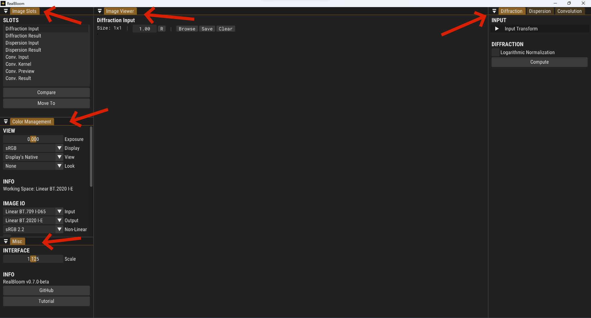

**This is a tutorial for [RealBloom](https://github.com/bean-mhm/realbloom) v0.7.0-beta.**

# Quick Start

This is a step-by-step guide with occasional tips to quickly get your hands on RealBloom. Below, we'll apply a convolutional bloom effect on a 3D render, and explore different parts of RealBloom. So buckle up, run the [latest release](https://github.com/bean-mhm/realbloom/releases), and let's get started.

First off, I highly suggest you watch [this video](https://www.youtube.com/watch?v=QWqb5Gewbx8) by AngeTheGreat, if you want to have a general idea of what we're gonna do in this tutorial, and how RealBloom works in general.

RealBloom provides 3 main functionalities in order to achieve a photorealistic bloom effect.

 1. Simulating the **Diffraction Pattern** of an aperture.
 2. Applying **Dispersion** to the pattern.
 3. Performing **Convolution** to achieve bloom.

If any of these terms sound alien to you, fear not, as they will be explained below.

# Interface

RealBloom provides a GUI (Graphical User Interface) and a CLI (Command Line Interface). We'll start by learning the GUI, and briefly talk about the CLI later. The layout is rather simple, as there's a single main window that provides everything we need.

There are a total of 7 different panels. A panel can be docked or floating, and you can resize it to your liking. Each panel may contain one or more "sections" that are shown by bold labels with uppercase letters.

 - **Image Slots**: A static list of image slots that serve different purposes. You can switch to another slot by clicking its name. We'll go through what each slot is used for later.

 - **Color Management**: Use this panel to define how importing, displaying, and exporting images will be done, as well as some other color-related options.

 - **Misc**: Miscellaneous information, along with a slider for the UI scale.

 - **Image Viewer**:  Displays the image contained in the selected slot.

- **Diffraction**: This module is used to generate the light diffraction pattern of an aperture, it uses a 2D FFT algorithm under the hood.

- **Dispersion**: This module is used to simulate the light dispersion effect on an arbitrary image.

- **Convolution**: This module convolves two two-dimensional images together. We can apply different effects using convolution, including bloom, halation, motion blur with custom curves, uniform lens blur, and other effects.

# Aperture

An [aperture](https://en.wikipedia.org/wiki/Aperture) is a hole through which light travels, usually in order to reach the camera sensor or the film. Because of light's wave properties, this causes a [diffraction](https://en.wikipedia.org/wiki/Diffraction) pattern to form, affecting all images captured by the camera. The diffraction pattern usually looks like a star or a halo, but it generally depends on the shape of the aperture. Diffraction is what makes stars have *the star shape*.

Let's start by loading an image that represents the geometric shape of our aperture. In the *Image Slots* panel, select the first slot, *Diffraction Input*. Then, in the *Image Viewer* panel, click *Browse* and choose your image. There are a bunch of example aperture shapes in `demo/Apertures` ready for you. I will be using `Octagon.png`.

> I've slightly reduced the zoom level in the *Image Viewer* panel for the image to fit into the screen. The zoom control is placed to the right of the image size indicator.
 
# Diffraction

Let's now see what the diffraction pattern of our aperture looks like, but first, let's look at the input options and controls in the *Diffraction* panel.

You'll notice a collapsed group of controls named *Input Transform* in the *INPUT* section under the *Diffraction* panel. RealBloom applies what's called an *Image Transform* on any input image used by any module. An *Image Transform* lets us apply basic corrections and modifications to our input images before feeding them to modules. You'll see *Image Transform* controls in the other module panels as well. Here's what you can generally achieve with an *Image Transform*.

| Section | Description |
|--|--|
| CROP & RESIZE | Controls for cropping and/or resizing the image |
| TRANSFORM | Simple linear transformations including scaling, rotation, and translation |
| COLOR | Basic color transformations |

We'll leave the *Input Transform* settings unchanged in this case.

The *Logarithmic Normalization* option in the *DIFFRACTION* section can be used to generate images with visually less dynamic range or contrast. For more realistic results, we'll leave this off.

Continue by clicking the *Compute* button in the *DIFFRACTION* section. This will generate the diffraction pattern of our aperture shape using a [2D FFT algorithm](https://en.wikipedia.org/wiki/Fast_Fourier_transform). Keep in mind we're referring to the far-field [Fraunhofer diffraction pattern](https://en.wikipedia.org/wiki/Fraunhofer_diffraction) here.

> I've temporarily increased my view exposure in the *Color Management* panel so that we can see the image properly. This doesn't affect the original image in any way, it only alters how the image is displayed.

> Notice how the selected image slot has changed to *Diffraction Result*.

# Dispersion

Our little star pattern isn't quite ready to be used yet. In the real world, the scale of the pattern depends on the wavelength of light, making it appear colorful and "rainbowy". We can simulate [this phenomenon](https://en.wikipedia.org/wiki/Dispersion_%28optics%29) using the *Dispersion* module. This module works by making several copies of the input image (called samples) and slowly scaling them from small to large, while changing the color (derived from the wavelength) at the same time.

The *Dispersion* module accepts any image as its input. In this case, however, we want to apply dispersion on the diffraction pattern that we just generated above. The diffraction pattern is in the *Diffraction Result* slot, but we need it to be in the *Dispersion Input* slot. *If only there was a quick way to move images between slots!* Yes, yes, there is a quick and convenient way.
1. Switch to the *Diffraction Result* slot.
2. Click the *Move To* button in the *Image Slots* panel.
3. Set the *Destination* slot to *Dispersion Input* if it's not already set to that.
4. You can enable the *Preserve Original* option if you want to keep the original image in the source slot and only make a copy of it.
5. Hit *OK*.

Back to the *Dispersion* panel. We'll leave the *Input Transform* settings unchanged in this case. The following explains what the controls in the *DISPERSION* section do.

| Parameter | Description | Range |
|--|--|--|
| Amount | Amount of dispersion. This defines the logarithmic difference between the largest and the smallest scale. | [0, +inf) |
| Edge Offset | Offset for the scale range. A value of -1 will fit all sample in the image, such that the largest scale will be 1. A value of +1 will define the minimum scale as 1, and all other samples will be larger than the image can fit. | [-1, +1] |
| Steps | Number of wavelengths to sample from the visible light spectrum, and the number of copies made. A value of 32 is only enough for previewing. | [1, 2048] |
| Method | Dispersion method | - |
| Threads | Number of threads to use in the CPU method | Hardware-dependant |

After adjusting the parameters to your liking - or copying the values from the screenshot below - hit *Apply Dispersion*.

> In the *Color Management* panel, I've set my *View* to *flim (default)*, and I'm using the *Punchy* look. More on this in a minute.

Now, use the *Move To* button again to move the *Dispersion Result* into the *Conv. Kernel* slot. We'll explore this slot right below.

# Convolution

Convolution is a generic operation that can be used to achieve many different effects. It's like a moving weighted average that can be performed on a 1D signal like audio, a 2D image, or any number of dimensions. Convolution is very powerful and can be used to achieve lots of cool audio and image effects, and many other things in different fields. I highly, highly, recommend watching [this video](https://youtu.be/KuXjwB4LzSA) by 3Blue1Brown to get a better understanding of convolution.

## The Input Images

Let's talk about the two inputs the *Convolution* module needs: *Conv. Input*, and *Conv. Kernel*. Mathematically, the input and the kernel are just two images that will be convolved together. Convolution is commutative, just like multiplication: A\*B = B\*A. So, technically, we don't really have to treat them as if they have different functionalities. However, the input is typically the image we want to apply our effect on, and the kernel is what defines the "shape" of the effect in a sense. My hope is to give you an intuition of convolution in this tutorial.

We generally need to use open-domain images for bloom, which preserve pixel values outside the [0, 1] range. If you're confused, here are some questions and answers to hopefully help you better understand how open-domain (A.K.A. HDR) images work. If you're a nerd in this field, feel free to skip this part.

> Q: **What is an open-domain Image?**

> A: Most everyday image formats such as PNG and JPEG can only have RGB values from 0-1 which translates to 0-255 when stored using unsigned 8-bit integers. Hence, they are called closed-domain formats. Most closed-domain images have some form of an [OETF](https://en.wikipedia.org/wiki/Transfer_functions_in_imaging), widely known as a "Gamma" function, applied on the pixel values, therefore they may be called non-linear images. On the other hand, an open-domain image accepts any real number for its pixel values, while also providing more depth and precision, as it is typically stored using a 32-bit or 16-bit floating-point number per color channel. It is very common for these images to have linear pixel values. They may also be called "HDR" images in some places.

> Q: **How do you store these images?**

> A: Image formats like [OpenEXR](https://en.wikipedia.org/wiki/OpenEXR) and [TIFF](https://en.wikipedia.org/wiki/TIFF) allow us to store pixel data as floating-point numbers that aren't limited to any range.

> Q: **How do you display them on a monitor?**

> A: This is a huge topic, but I'll try to summarize what you'll need to know. Pixel values higher than 1 (100% brightness that the monitor supports) usually just get clamped down to 1 before being displayed on your monitor, making the bright parts of the image look overexposed and blown out, and introducing weird hue skews. Some games and programs use custom display/view transforms to nicely convert linear RGB values into something that can be correctly displayed on your monitor (sometimes called "tone mapping"). Some games can produce true HDR output if your monitor supports it, but that's another story. Despite the pixel values being clamped and/or transformed when *displayed*, they are still *stored* as their original floating-point values in memory.

> Q: **Does RealBloom support display transforms?**

> A: Yes. RealBloom supports display/view transforms through [OpenColorIO](https://opencolorio.org/). In the *Color Management* panel, you can switch the view to *[AgX](https://github.com/sobotka/SB2383-Configuration-Generation)* or one of [flim](https://github.com/bean-mhm/flim)'s presets to have a better view of 3D scenes and HDR images in general. Note that this may ruin images that have already been transformed and processed through camera software, so this works best on raw linear tristimulus output from your rendering software, or a carefully developed RAW image, typically stored in the OpenEXR format.

> Q: **What is AgX?**

> A: [AgX](https://github.com/sobotka/SB2383-Configuration-Generation) is an experimental OCIO config made by [Troy James Sobotka](https://twitter.com/troy_s), aimed at cinematic and filmic color transforms. Troy is the author of the famous Filmic config for Blender, and a master of color science.

> Q: **What is flim?**

> A: [flim](https://github.com/bean-mhm/flim) is a filmic transform I've made, inspired by AgX and made with the help of Troy.

> Q: **What is grace?**

> A: [grace](https://github.com/bean-mhm/grace) is a small generic OpenColorIO config for rendering, photography, and other stuff involving color management or tone mapping. grace contains both AgX's and flim's transforms. RealBloom uses grace as its default user config, as well as its internal config which we'll discuss later.

Now, select the *Conv. Input* slot and hit *Browse* to choose an image. I have included some open-domain images in `demo/Images`. For this tutorial, I'll be using `Leaves.exr`, which is a render I made in Blender to demonstrate convolutional bloom.

> Bloom works best on scenes with extremely bright spots on dark backgrounds. Forcing bloom on low-contrast and flat images may take away from realism.

You can use one of the filmic transforms for this image, as this is (almost) raw linear data from a 3D scene. I will reset the look, and increase my view exposure slightly.
 

We have already moved our dispersion result to the *Conv. Kernel* slot, so at this point, all the inputs are loaded.

> The kernel doesn't necessarily have to be a diffraction pattern. You can use anything as the kernel, so try experimenting with it.

## The *KERNEL* Section

I'll continue by modifying the *Kernel Transform* settings slightly, while leaving the *Input Transform* settings unchanged. I'll set *Crop* to 0.9, and *Resize* to 1.1. I'll then use the following tristimulus for the *Filter* in the *COLOR* section.

Also in the *COLOR* section, I'll set the *Exposure* to 6.0, and *Contrast* to 0.2.

> Ctrl+Click on a slider to type a custom value.

In the *KERNEL* section, the *Use Transform Origin* option defines whether the origin point from the *TRANSFORM* section in the *Kernel Transform* options will be used as the origin for convolution, that is, whether the kernel will be centered around this point. If you want the kernel to be perfectly centered in convolution, adjust the scale such that the resolution only has odd numbers. To get intuition for why this is the case, suppose we have a 3x3 grid of pixels, and another 4x4 grid of pixels. Clearly, the 3x3 grid has a pixel that is perfectly centered, while the 4x4 grid does not.

At this point, our input images for convolution are ready.

## The *CONVOLUTION* Section

Further down the *Convolution* panel, there are a few important controls in the *CONVOLUTION* section that we'll quickly go through.

## Convolution Method

RealBloom provides 4 underlying methods to perform convolution.

| Method | Description |
|--|--|
| FFT CPU | Uses the [FFT](https://en.wikipedia.org/wiki/Fast_Fourier_transform) algorithm and the [convolution theorem](https://en.wikipedia.org/wiki/Convolution_theorem) to perform convolution in a much more optimized way. So far, this is the fastest implementation available. |
| FFT GPU (Experimental) | Same as the previous method, but runs on the GPU instead. This method is in an experimental phase and performs poorly in the current version. |
| Naive CPU | Uses the traditional algorithm for convolution, which is inefficient for large inputs. |
| Naive GPU | Same as the previous method, but runs on the GPU instead. Usually quite a lot faster than the CPU method. |

For this tutorial, we'll go with *FFT CPU*.

### Deconvolution

If you have selected the *FFT CPU* method, you'll see an option called *Deconvolve*. This is an experimental feature for applying what I call "reverse convolutions". We won't use this feature in this tutorial.

### Threads & Chunks

In the *Naive CPU* method, you can split the job between multiple threads that run simultaneously. In *Naive GPU*, you can split the input data into several chunks to avoid overloading the GPU.

| Threads | Chunks |
|--|--|
| Each thread processes  a part of the input data at the same time as all the other threads.  | Chunks are processed sequentially to reduce GPU load. |
| Threads speed up the process by a noticeable amount. | Chunks may slow down the process by a slight amount, while helping us avoid GPU crashes. |

> *FFT CPU* will automatically decide the optimal number of threads to use.

## Convolution Threshold

A brightness threshold can be optionally applied to the input image to only select the brighter parts of the image for convolution. We can increase the threshold to skip pixels that aren't bright enough to contribute to the final result. The *Knee* parameter defines how smooth the transition will be. A higher threshold speeds up the process in naive convolution, but it does not affect the performance in the FFT method(s).

In the *Conv. Preview* slot, we can observe what the convolution process will see after the threshold is applied.

Using a threshold of 0 and mixing the convolution output with the original input generally gives more realistic and appealing results, so we'll set the threshold parameters to 0 for this tutorial, which will leave the input image unchanged.

## Auto-Exposure

This option can be used to automatically adjust the exposure of the kernel so that the convolution output and the input image match in brightness. This is done by making the pixel values in the kernel add up to 1, hence preserving the overall brightness. We'll have this on for this demonstration.

## Convolve

We now have all our input images and parameters ready, so we can finally hit *Convolve* to perform convolution. The output will be blended with the original input image afterward. We can adjust the mixing parameters in the *BLENDING* section.

## The *BLENDING* Section

Let's hit *Show Conv. Layer* to see how the convolution output looks on its own.

Generally speaking, the convolution layer should have the same overall brightness as the input. We can use the *Exposure* slider to adjust the exposure of the convolution layer. In this case, we don't need to do this, as we had enabled the *Auto-Exposure* option.

You can enable additive blending using the *Additive* checkbox, although it is usually more accurate and best not to use this blending mode unless the input image had a threshold applied to it.

> You'll notice a *Compare* button in the *Image Slots* panel. We can use this to compare *Conv. Input* with *Conv. Result*. This button works with the other modules as well.

Finally, having selected the *Conv. Result* slot, click the *Save* button in the *Image Viewer* panel to export the result into an image file.

# Congratulations

The tutorial is done. Take a small break or something. Below, we'll explore the other parts of RealBloom and its internals.

# Color Management

RealBloom uses [OpenColorIO](https://opencolorio.org/) for color management. For those of you interested, I'll quickly explain the Color Management panel and what it provides. For more information, there will be links to some helpful articles about color management below.

## OCIO Configs

An [OpenColorIO](https://opencolorio.org/) config typically contains an organized list of transforms and settings for color management. The following is what you typically find in an OCIO config (not in order), along with short descriptions. Note that this is my own understanding as a learner, so take it with a grain of salt.

| Element | Description |
|--|--|
| Reference Color Space | Not to be confused with the working color space, the reference color space is used to convert from any color space to any other color space. If we know how to go from color space *A* to the reference and vice versa, and we know how to go from color space *B* to the reference and vice versa, then we can easily go from *A* to *B* by first converting to the reference space, then to the target color space, *B*. |
| Color Space | A color space usually tells OCIO how to convert from and to the reference space by describing what transforms to use. It may also contain additional information about how data must be stored in said color space, a description, a list of aliases, and so on. |
| View | A view simply references a color space to be used. It may have a different name than the reference color space. |
| Display | A display contains a list of views that can be used with said display format. |
| Role | Roles are simply aliases for color spaces. As an example, the line `reference: Linear CIE-XYZ I-E` defines the reference color space. The `scene_linear` role generally defines the color space in which rendering and processing should be done. The `data` role defines the color space used for raw or generic data, A.K.A non-color data. The `color_picking` role defines what color space should be used in color pickers, and so on. Note that a program does not have to use these roles. For example, a program might always use `sRGB` in its color pickers regardless of the `color_picking` role. The `reference` role is an exception of this, as it is always used to convert between color spaces. |
| Look | A look is an optional transform that may be applied to an image before displaying it. |

The OCIO library lets us convert between color spaces, apply display/view transforms and looks, and so on.

By default, RealBloom contains two configs: a user config, and an internal config. The user config is stored in the `ocio` folder located in the program directory. You may swap the contents with your own custom OCIO config. The internal config can be used for XYZ conversions and generally shouldn't be modified. This will be further explained below.

## VIEW

Here we can alter how we *view* the image contained in the current slot, by adjusting the exposure, the *Display* type, and the *View* transform, and optionally choosing an artistic *Look*. This does not affect the pixel values of the image in any way, it just defines how the image is displayed.

## INFO

This section displays the working color space of the current OCIO config, or more specifically, the color space associated with the `scene_linear` role. If there are any errors in RealBloom's Color Management System (CMS), they will also be shown in this section.

## IMAGE IO

These settings define how images are imported and exported.

| Parameter | Description |
|--|--|
| Input | The interpreted color space when importing images in linear formats such as OpenEXR. The imported image will be converted from this color space to the working space. |
| Output | The output color space when exporting images in linear formats without a display/view transform. |
| Non-Linear | The interpreted color space when importing images in non-linear formats like PNG and JPEG. |
| Auto-Detect | If enabled, RealBloom will try to detect the color space when loading linear images, and discard the *Input* setting if a color space was detected. |
| Apply View Transform | If enabled, the current display/view transform will be applied when exporting linear images. The display/view transform is always applied to non-linear images. |

## COLOR MATCHING

Color Matching Functions (CMF) help us go from the visible light wavelengths to [XYZ tristimulus](https://en.wikipedia.org/wiki/CIE_1931_color_space) when simulating dispersion. RealBloom looks for [CSV](https://en.wikipedia.org/wiki/Comma-separated_values) files in the `cmf` folder located in the program directory, in order to recognize and parse the available CMF tables. There are a few CMF tables included by default. You can hit *Preview* to see what will be sampled for dispersion.

## XYZ CONVERSION

Here we can alter how the XYZ values from a CMF table will be converted to RGB tristimulus in the working space. The *User Config* method should be used if the user config contains the CIE XYZ I-E color space. Otherwise, you can use the *Common Space* method and choose a color space that exists in both your config and RealBloom's internal OCIO config.

The following is the order of color space conversions when using the *Common Space* method.

1. Using the internal config, convert from CIE XYZ I-E to the common color space.
2. Using the user config, convert from the common color space to the working space.

# Command Line Interface

RealBloom provides a CLI that can be used from within a terminal or any other program. This can be useful for animations, batch processing, and automated scripts. The commands are self-explanatory, as they deliver the same functionality as the GUI.

You can enter the CLI by running `realbloom cli` in the program directory. Type `help` to see a list of the supported commands. Use `quit` to exit the program. If you run RealBloom with an empty command, or anything other than `cli`, it will start the GUI.

If you're interested in using RealBloom for animations, you can take a look at `demo/Scripts/anim_conv.py` which is a basic Python script for performing convolution on a sequence of frames.

# GPU Helper

Some of the modules may use RealBloom's GPU helper program if needed. The GPU helper tries to perform operations on the dedicated GPU, while the main program and its GUI are intended to run on the integrated GPU. This is only relevant for Dual-GPU systems.

You can check your `%TEMP%` directory and look for the most recent text file, the name of which starts with `realbloom_gpu_operation`. This log file will contain the name of the GPU (Renderer) on which the operation was run. If the GPU helper isn't using the desired GPU, visit **Windows Settings > System > Display > Graphics** to change the default/preferred GPU for `RealBloomGpuHelper.exe`. This might differ for older versions of Windows.

> There's no official way to choose a specific GPU device using OpenGL on Windows. However, we can "signal" to NVIDIA and AMD drivers that "this program needs the high-performance GPU". RealBloom's main program does not contain this signal, while the GPU helper does. This makes the process easier on most Dual-GPU systems, as the UI continues to render smoothly while the dedicated GPU is busy.

# Community

If you use RealBloom to improve your artwork or make an artwork using RealBloom, feel free to publish it on social media under #realbloom.

☀️ **RealBloom Community Server:** [Discord](https://discord.gg/Xez5yec8Hh)

# Thank You!

If you find RealBloom useful, consider introducing it to a friend or anyone who you think would be interested. Don't forget to give the project a star! I appreciate your time, have a bloomy day!

I'd also like to say a huge thank you to [Nihal](https://twitter.com/Mulana3D) and their colleagues for supporting the development of RealBloom by helping with research, testing dev builds, finding bugs, suggesting new features - including a CLI, the use of OCIO, adding demo kernels, etc. - and trying out RealBloom on their renders.

# Read More

 - [Convolutional Bloom in Unreal Engine](https://docs.unrealengine.com/5.0/en-US/bloom-in-unreal-engine/#bloom-convolution:~:text=%235-,Bloom%20Convolution,-The%20Bloom%20Convolution)
 - [The Hitchhiker's Guide to Digital Colour](https://hg2dc.com/)
 - [CG Cinematography - Christophe Brejon](https://chrisbrejon.com/cg-cinematography/)
 - [But what is a convolution? - 3Blue1Brown](https://www.youtube.com/watch?v=KuXjwB4LzSA)
 - [But what is the Fourier Transform? A visual introduction. - 3Blue1Brown](https://www.youtube.com/watch?v=spUNpyF58BY)
